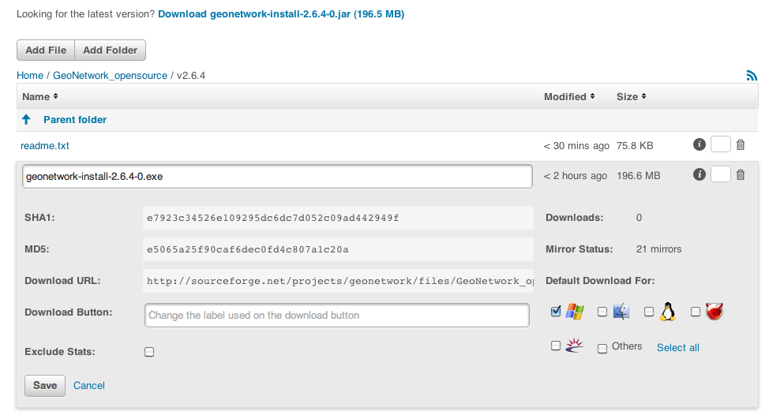

.. _stable:

Create a stable release for GeoNetwork
======================================

This guide details the process of performing a GeoNetwork release.

.. note :: * BRANCH: Branches are created for major stables releases and end with .x (for example 2.6.x) 
	* VERSION (for tag): version to release (for example 2.6.1)	
	* NEW_VERSION (for branch): next version (for example 2.6.2)

Release committee
-----------------

To create new releases a committee of 3-4 persons should be choosen. The members of the committee are 
responsible of creating the releases following the steps described in this document to guarantee the
quality of releases.

A rotation policy can be use to select the person of the committee responsible of creating a release. 

Notify developer lists
----------------------

It is good practice to notify the GeoNetwork developer list of the intention to make the release a few days in advance.

On the day the release is being made a warning mail **must** be send to the list asking that developers refrain from committing until the release tag has been created.

Prerequisites
-------------

The following are necessary to perform a GeoNetwork release:

1. Commit access to `GeoNetwork svn <https://geonetwork.svn.sourceforge.net/svnroot/geonetwork/>`_
2. Administration rights to SourceForge server to publish the release

Update source code from SVN
---------------------------

.. warning :: This steps must be performed in branch code.

1. Update or check out the **branch** to be released from.
2. Ensure that **svn status** yields no local modifications.

Test issues solved for new release
``````````````````````````````````

1. Create an installer ::

	$ mvn clean install
	$ cd installer
	$ ant
	
2. Install the installer located in ``geonetwork-[VERSION]`` folder

3. Test the issues included for the release, checking in `GeoNetwork trac <http://trac.osgeo.org/geonetwork/>`_.

If tests are passed, proceed with the release. Otherwise:

1. If any critical bug detected, fix before continue with the release.
2. If no critical bug detected, move the bug to next release and continue with release 

.. note :: **to discuss and get feedback**

	This approach implicates a code freeze in branch until the release is done, if all test are ok (no bugs found in tests or non critical bugs), 1 day or less is ok.

	If a critical bug is detected, the code freeze can take some time if a bug is complicated to fix. To avoid this code freeze some alternatives can be considered:

	1. If there is a commit on the branch before the critical fix is commited, it will be part of the release (properly tested in a new release cycle)
	2. Create a tag anyway and commit the critical fix to that tag/branch/trunk so there is no freeze on the branch at all. 
	No other commits should happen on a tag, except critical bug fixes. This allows people to commit on the branch while the critical bug is been solved.

Update changes.txt file
----------------------

1. Add an entry to ``docs/changes.txt`` describing the changes in this new release, using the following template. 

Comments from the SVN commits are used to extract the most important changes (e.g. use ``svn log -r 7219:HEAD > ~/changes264.txt`` to obtain these. Some cleanup is required before adding them in the changes.txt document) 
::
	================================================================================
	===
	=== GeoNetwork [VERSION]: List of changes
	===
	================================================================================
	--------------------------------------------------------------------------------
	--- Bug fixes
	--------------------------------------------------------------------------------
	- Fix fo issue #NUMBER: Description of fix
	- Fix fo issue #NUMBER: Description of fix
	- ...

	--------------------------------------------------------------------------------
	--- Changes
	--------------------------------------------------------------------------------
	- Description of change
	- Description of change
	- ...
	
2. Commit ``docs/changes.txt`` file ::

	$ svn commit -m "Updating CHANGES for [VERSION]" docs/changes.txt


Update version numbers for a release
------------------------------------

A \*NIX (Linux, OSX etc..) operating system can use the following batch script.

1. Execute in root of the **branch** source tree ``updateReleaseVersions.sh``. Example to create version 2.6.1 from 2.6.1-SNAPSHOT ::

	$ ./updateReleaseVersions.sh 2.6.1

2. Commit updated files ::

	$ svn commit -m "Updated files version to [VERSION]" .

Create release tag
------------------

1. Create a tag for the release ::

	$ svn copy -m "Create tag for release [VERSION]"
        	https://geonetwork.svn.sourceforge.net/svnroot/geonetwork/branches/[BRANCH]
        	https://geonetwork.svn.sourceforge.net/svnroot/geonetwork/tags/[VERSION]

2. Checkout the release tag ::

 	$ svn co https://geonetwork.svn.sourceforge.net/svnroot/geonetwork/tags/[VERSION]


Build release artifacts
-----------------------

.. warning :: All operations for the remainder of this guide must be performed from the release tag, not the branch. Unless otherwise stated.

1. Uncomment doc sections in ``web/pom.xml``::

	<webResources>
  		<resource>
    		<directory>../docs/eng/users/build/html</directory>
    		<targetPath>docs/eng/users</targetPath>
  		</resource>
  		...
	</webResources>


2. Build documentation. In ``docs`` folder, execute ::

	$ mvn clean install

.. note :: Building the GeoNetwork documentation requires the following be installed:

        * `Sphinx <http://sphinx.pocoo.org/>`_, version 0.6 or greater
        * `pdflatex <http://www.tug.org/applications/pdftex/>`_ utility to build PDF files
        * Make utility

3. Compile from the root of the source tree ::

	$ mvn clean install
	
WAR distribution
----------------

After building the release articfacts in previous steps, the war distribution of the new release is located in: ``web/target/geonetwork.war``


Build installers
----------------

To build the Windows and platform independent installers, execute the next command in ``installer`` folder ::

	$ ant
	

The installers (exe and jar) are created in a folder ``geonetwork-[VERSION]``

Upload and release on SourceForge
---------------------------------

All of the artifacts generated so far need to be uploaded to the SourceForce File release System:

1. WAR distribution
2. Installers (exe and jar)

.. note :: This step requires administrative privileges in SourceForge for the GeoNetwork opensource project.

1. Log in to `SourceForge <http://sourceforge.net/account/login.php>`_.

2. Go to the ` GeoNetwork Files section <https://sourceforge.net/projects/geonetwork/files/GeoNetwork_opensource/>`_.

3. Add the new v[VERSION] folder for this release.

4.a. Using the commandline secure copy is the simplest way for developers working under a \*NIX like system: ::

	$ scp geonetwork.war username@frs.sourceforge.net:/home/frs/project/g/ge/geonetwork/GeoNetwork_opensource/v[VERSION]/
	$ scp geonetwork-[VERSION].jar username@frs.sourceforge.net:/home/frs/project/g/ge/geonetwork/GeoNetwork_opensource/v[VERSION]/
	$ scp geonetwork-[VERSION].exe username@frs.sourceforge.net:/home/frs/project/g/ge/geonetwork/GeoNetwork_opensource/v[VERSION]/
	$ scp docs/readme.txt username@frs.sourceforge.net:/home/frs/project/g/ge/geonetwork/GeoNetwork_opensource/v[VERSION]/

4.b. The same can be accomplished in Windows using `WinSCP <http://winscp.net/>`_. Or a desktop client like `Cyberduck <http://cyberduck.ch/>`_ on Windows and Mac OS X

5. Once the upload of the files has been completed, use the web interface to set the default download files. 
The (i) button allows to set the default operating systems for each installer (.exe for Windows and .jar for all other systems).



6. The default downloads are ready now.

Update geonetwork-opensource website
------------------------------------

The website requires updates to reflect the new release. Update the version number and add a new news entry in the following files:

  website/docsrc/conf.py
  website/docsrc/docs.rst
  website/docsrc/downloads.rst
  website/docsrc/index.rst
  website/docsrc/news.rst
  website/checkup_docs.sh 
  
Commit the changes and build the website using the `Hudson deployment system <http://thor.geocat.net/hudson/>`_

Announce the release
--------------------

Mailing lists
`````````````
Send an email to both the developers list and users list announcing the release.

``TODO``: Template mail?

SourceForge
```````````

``TODO``: Do we create SourceForge notifications?

Close the tag
-------------

.. warning :: This script must be configured in SVN server.

After a version is released we must "close" the tag to prevent commits using a *pre-commit* script in SVN like ::

	#!/bin/sh

	REPOS="$1"
	TXN="$2"

	SVNLOOK=/usr/bin/svnlook

	# Committing to tags is not allowed
	$SVNLOOK changed -t "$TXN" "$REPOS" | grep "^U\W*tags" && /bin/echo "Cannot commit to tags!" 1>&2 && exit 1

	# All checks passed, so allow the commit.
	exit 0


``TODO``: Check the regular expression to identify the tags. After creating a tag we commit the new versions in tag, so we need to close the tag when the release it's finished.

Upgrade branch pom versions
---------------------------

.. warning :: This steps must be performed using branch code.

After a release has being created the branch version number must be increased to next release version. On a \*NIX (Linux, OSX etc..) operating system you can use the following batch script.

1. From the root of the **branch** source tree execute the script ``updateBranchVersions.sh``. To update from version 2.6.1-SNAPSHOT to 2.6.2-SNAPSHOT for example ::

	$ ./updateBranchVersions.sh 2.6.1 2.6.2

2. Commit the updated files ::

	$ svn commit -m "Updated files version to [VERSION]-SNAPSHOT" .

