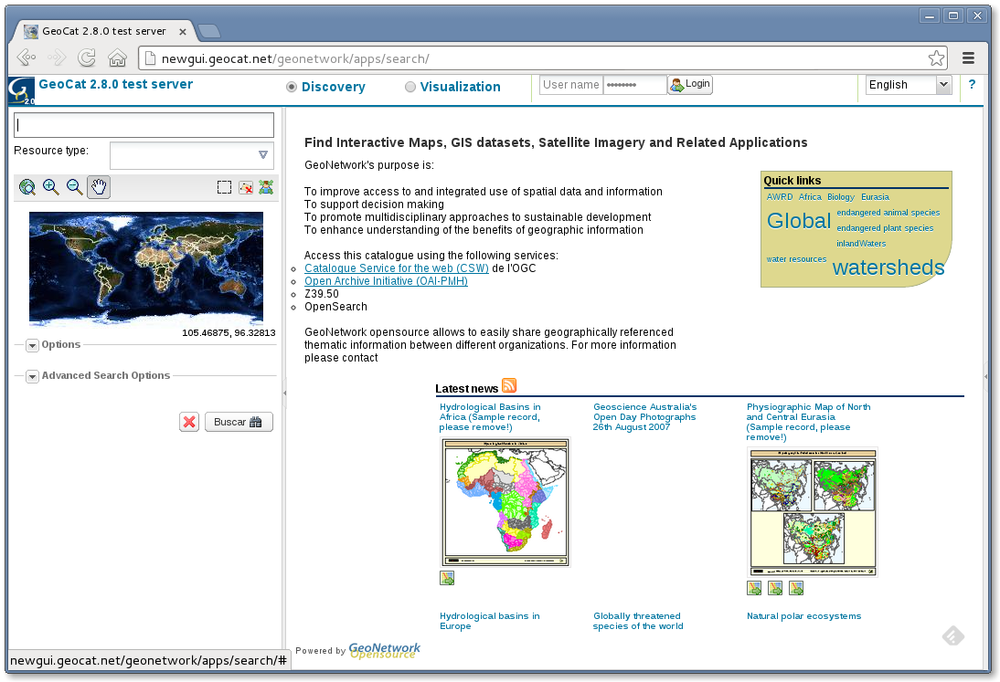
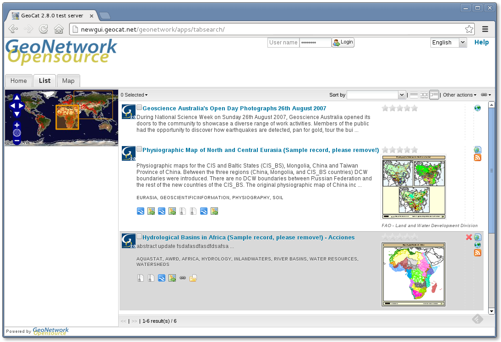
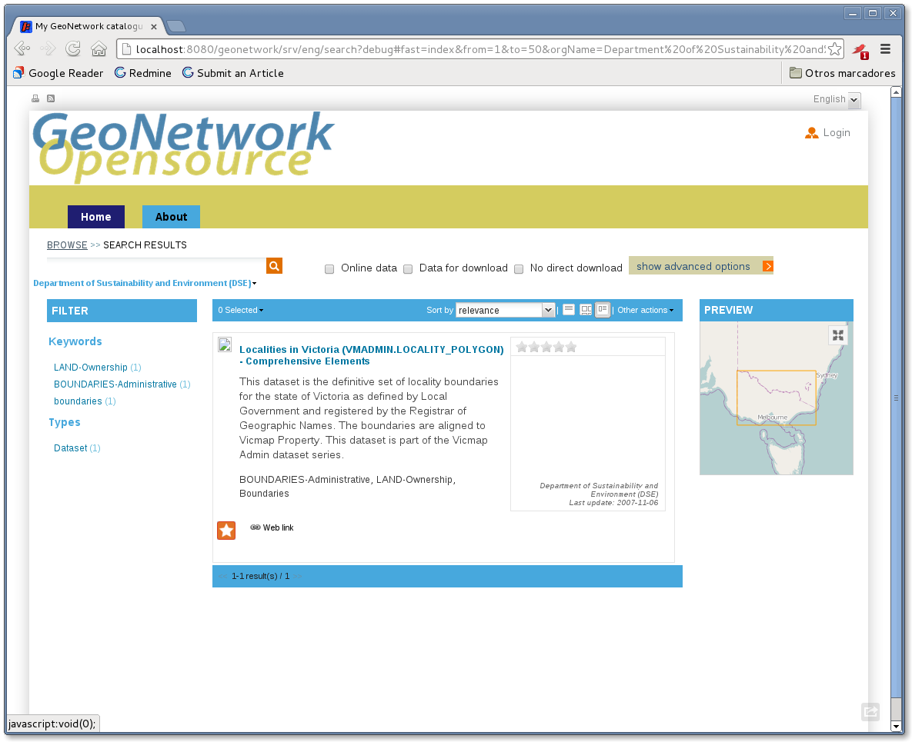

.. _userinterface:

User Interface
==============

There are four different user interfaces on geonetwork:

- **Classic** - Perfect for hard environments, uses less javascript.

- **Search** - Uses the new widgets library. More responsive than the classic UI. `Example <http://newgui.geocat.net/geonetwork/apps/search/>`_

- **TabSearch** - Similar to the **Search** UI, but desktop-like as it uses tabs. `Example <http://newgui.geocat.net/geonetwork/apps/tabsearch/>`_

- **HTML5UI** - Also based on widgets, makes use of latest web technologies.

Compatibility table:

+------------------------+--------------------+--------------------+--------------------+--------------------+--------------------+--------------------+--------------------+
| Compatibility          |                                        IE                                         |    Chrome          |        Firefox     |       Safari       |
+------------------------+--------------------+--------------------+--------------------+--------------------+--------------------+--------------------+--------------------+
|                        |         7          |   8                |                9   |                10  |                    |                    |                    |
+========================+====================+====================+====================+====================+====================+====================+====================+
| Classic                | .. figure:: ok.png | .. figure:: ok.png | .. figure:: ok.png |                    | .. figure:: ok.png | .. figure:: ok.png | .. figure:: ok.png |
+------------------------+--------------------+--------------------+--------------------+--------------------+--------------------+--------------------+--------------------+
| Search                 | .. figure:: ok.png | .. figure:: ok.png | .. figure:: ok.png |                    | .. figure:: ok.png | .. figure:: ok.png | .. figure:: ok.png |
+------------------------+--------------------+--------------------+--------------------+--------------------+--------------------+--------------------+--------------------+
| TabSearch              | .. figure:: ok.png | .. figure:: ok.png | .. figure:: ok.png |                    | .. figure:: ok.png | .. figure:: ok.png | .. figure:: ok.png |
+------------------------+--------------------+--------------------+--------------------+--------------------+--------------------+--------------------+--------------------+
| HTML5UI                | .. figure:: pl.png | .. figure:: ok.png | .. figure:: ok.png |                    | .. figure:: ok.png | .. figure:: ok.png | .. figure:: ok.png |
+------------------------+--------------------+--------------------+--------------------+--------------------+--------------------+--------------------+--------------------+

Full compatibility .. figure:: ok.png
Compatibility with penalties .. figure:: pl.png  
No compatible .. figure:: no.png  

Blank spaces means no information provided for that case.

Classic
-------
//TODO

Search
-------

To use this UI, you have to compile the web project with **widgets** profile activated, like:
  mvn clean package -Pwidgets

TabSearch
-------

To use this UI, you have to compile the web project with **widgets-tab** profile activated, like:
  mvn clean package -Pwidgets-tab

HTML5UI
-------

To use this UI, you have to compile the web project with **html5ui** profile activated, like:
  mvn clean package -Phtml5ui

