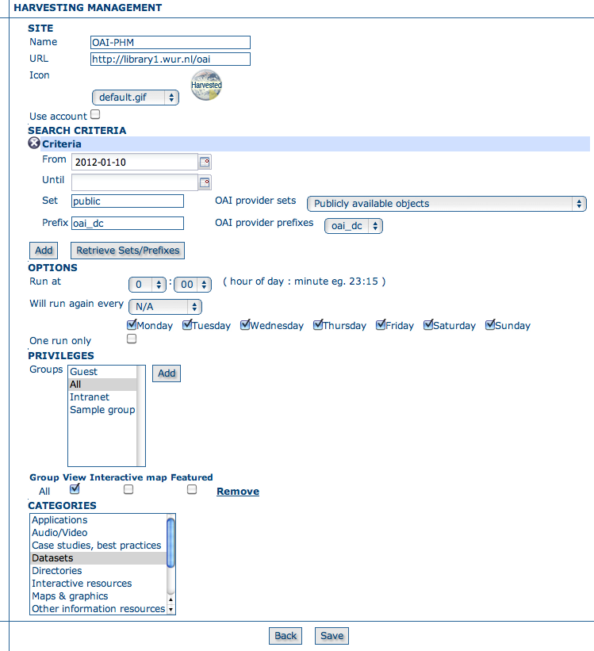
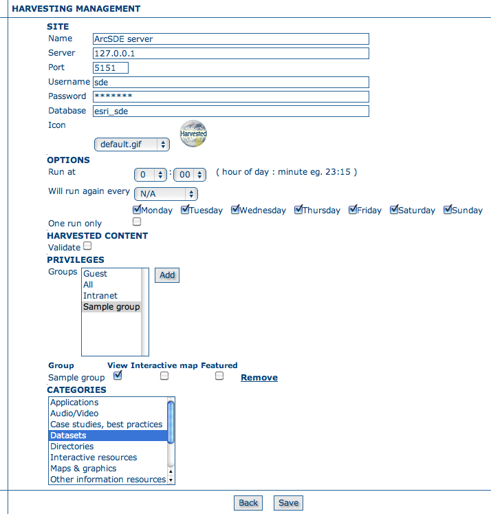
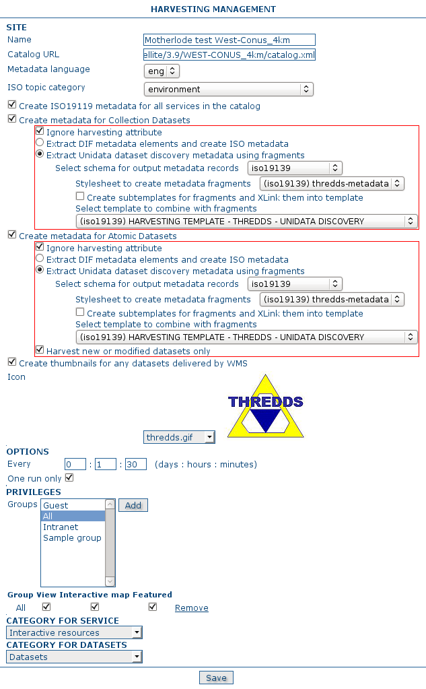

.. _harvesting:

Harvesting
==========

Introduction
------------

Since the beginning of the project, there has been the need to share metadata
among several GeoNetwork nodes. Usually, each node takes care of a region of
interest so it is important to be able to perform a search over all these nodes at
the same time. This is called distributed search and exploits the Internet
connectivity. In our cases, this distributed search can be heavy to perform if there
are many maps with associated thumbnails. Furthermore, GeoNetwork is usually
employed in areas (like Africa, Asia) where the connectivity can be limited, making
the use of distributed search not feasible.

Harvesting is the process of collecting remote metadata and storing them
locally for a faster access. This is a periodic process to do, for example, once a
week. Harvesting is not a simple import: local and remote metadata are kept aligned.
Using some *magic*, one GeoNetwork node is capable of discovering metadata
that have been added, removed or updated in the remote node.

GeoNetwork is able to harvest from the following sources (for more details see below):

#. Another GeoNetwork node (version 2.1 or above).
#. An old GeoNetwork 2.0 node.
#. A WebDAV server.
#. A CSW 2.0.1 or 2.0.2 catalogue server.
#. An OAI-PMH server.
#. An OGC service using its GetCapabilities document. These include WMS, WFS, WPS and WCS services.
#. An ArcSDE server.
#. A THREDDS catalog.
#. An OGC WFS using a GetFeature query.
#. One or more Z3950 servers.

Mechanism overview
------------------

The harvesting mechanism is based on the concept of a *universally unique identifier (UUID)*.
This is a special id because it is not only
unique locally to the node that generated it but it is unique across all the world.
It is a combination of the network interface’s MAC address, the current date/time
and a random number. Every time you create a new metadata in GeoNetwork, a new UUID
is generated and assigned to it.

Another important concept behind the harvesting is the *last change date*.
Every time you change a metadata, its last change date is
updated. Just storing this parameter and comparing it with a new one allows any
system to find out if the metadata has been modified since last update.

These two concepts allow GeoNetwork to fetch a remote metadata, check if it has
been updated and remove it locally if it has been removed remotely. Furthermore,
thanks to UUIDs, a hierarchy of harvesting nodes can be built where B harvests from
C and A harvests from B. Even loops can be created because harvested metadata cannot
be modified.

Harvesting life cycle
---------------------

When a harvesting node is set, there is no harvested metadata. During the first
run, all remote matching metadata are retrieved and stored locally. After the first
run, only changed metadata are retrieved. Harvested metadata are not editable for
the following reasons:

#. The harvesting is periodic so any local change to harvested metadata will be lost during the next run.
#. The change date is used to keep track of changes so if it gets changed outside the originator site, the harvesting mechanism is compromised.

Beside the metadata itself, this implies that users cannot change all other metadata properties (like categories, privileges etc...).

The harvesting process goes on until one of the following situations arises:

#. An administrator stops (deactivates) the node.
#. An exception arises. In this case the node is automatically stopped.

When a harvesting node is removed, all harvest metadata are removed too.

Multiple harvesting and hierarchies
-----------------------------------

Catalogues that provide UUIDs for metadata (for example GeoNetwork and a CSW
server) can be harvested several times without having to take care about metadata
overlap. This allows the possibility to perform a thematic search and a metadata
belonging to multiple searches is harvested only once and not duplicated.

This mechanism allows the GeoNetwork harvesting type to be combined with other
GeoNetwork nodes to perform hierarchical harvesting. This way a metadata can be
harvested from several nodes. For example, consider this scenario:

#. Node (A) has created metadata (a)
#. Node (B) harvests (a) from (A)
#. Node (C) harvests (a) from (B)
#. Node (D) harvests from both (A), (B) and (C)

In this scenario, Node (D) will get the same metadata (a) from all 3 nodes (A),
(B), (C). The metadata will flow to (D) following 3 different paths but thanks to
its UUID only one copy will be stored. When (a) will be changed in (A), a new
version will flow to (D) but, thanks to the change date, the copy in (D) will be
updated with the most recent version.

General notes and issues
------------------------

General
```````

#. The harvesting engine does not store harvesting results. This implies that if the server is restarted the last results are lost.

#. Changes to the harvesting parameters (for example privileges and categories) are taken into account in the next harvesting run.

GeoNetwork harvesting type
``````````````````````````

#. During harvesting, site icons are harvested and local copies updated. Icons are propagated to new nodes as soon as these nodes harvest from this one.
#. The metadata UUID is taken from the info.xml file of the MEF bundle. Any UUID stored inside the metadata will be overwritten with this one.

WebDAV harvesting type
``````````````````````

#.  The same metadata could be harvested several times by different
    harvesting nodes. Anyway, this is not a good practise because every copy
    of the metadata will have a different UUID and the system will fill with
    different copies of the same metadata.

CSW harvesting type
```````````````````

#.  If the dct:modified element is missing from the GetRecords response
    the metadata will be always harvested.
#. Any exception during getRecordById operation is discarded and the metadata skipped.

OAI-PMH harvesting type
```````````````````````

#.  The id of the remote server must be a UUID. If not, metadata can be
    harvested but during hierarchical propagation id clashes could corrupt
    harvested metadata.
#.  During harvesting, GeoNetwork will try to auto detect the schema of
    each metadata. If the schema is not supported the metadata is
    skipped.

OGC service harvesting type
```````````````````````````

#.  Every time the harvester runs, it will remove previously harvested information
    and create new ones. GeoNetwork will generate the id for all metadata (both service and datasets).
    Therefor, for datasets, if the metadata is created using a remote XML document (ie.
    if a MetadataUrl tag is in the GetCapability document), the UUID of
    the document is used.
#.  Thumbnails are generated only for Web Map Service (WMS). The service should also support
    the WGS84 projection.

THREDDS catalog harvesting type
```````````````````````````````

#.	Every time the harvester runs, it will remove previously harvested fragments/records and create new fragments/records.

OGC WFS GetFeature harvesting type
``````````````````````````````````

#.	The first time the harvester runs, new records will be created by combining metadata fragments with a user specified template. Fragments can be saved into the GeoNetwork catalog as subtemplates and XLink'd into the template or they can be copied into the template.
#.	Thereafter, every time the harvester runs, new fragments will replace the old ones.

Z3950 server(s) harvesting type
```````````````````````````````

#.	Every time the harvester runs, it will remove previously harvested records and create new ones.

Harvesting Fragments of Metadata to support re-use
``````````````````````````````````````````````````

All the harvesters except for the THREDDS and OGC WFS GetFeature harvester create a complete metadata record that is inserted into or replaces an existing record in the catalog. However, it's often the case that:

- the metadata harvested from an external source is really only one or more fragments of the metadata required to describe a resource such as a dataset 
- you might want to combine harvested fragments of metadata with manually entered or static metadata in a single record
- a fragment of metadata harvested from an external source may be required in more than one metadata record

For example, you may only be interested in harvesting the geographic extent and/or contact information from an external source and manually entering or maintaining the remainder of the content in the metadata record. You may also be interested in re-using the contact information for a person or organisation in more than one metadata record.

To support this capability, both the WFS GetFeature Harvester and the THREDDS harvester, allow fragments of metadata to be harvested and linked or copied into a template record to create metadata records. Fragments that are saved into the GeoNetwork database are called subtemplates and can be used in more than one metadata record. These concepts are shown in the diagram below.

.. figure:: web-harvesting-fragments.png

		*Harvesting Metadata Fragments*

As shown above, an example of a metadata fragment is the gmd:contactInfo element of an iso19139 document.  This element contains contact details for an individual or an organisation.  If a fragment is stored in the geonetwork database as a subtemplate for a given person or organisation, then this fragment can be referenced in metadata records where this organisation or individual is specified using an XML linking mechanism called XLink. An example of an XLink is shown in the following diagram.

.. figure:: web-harvesting-xlinks.png


HTTPS support
`````````````

Harvesters support https protocol. If the server to harvest has a trusted certificate available in JVM keystore, configuring the https url in the harvester should be fine.

For self-signed/untrusted certificates, the harvester issues an exception like this::

    javax.net.ssl.SSLHandshakeException: 
       sun.security.validator.ValidatorException: PKIX path building failed: 
       sun.security.provider.certpath.SunCertPathBuilderException: 
       unable to find valid certification path to requested target
     
    Caused by: sun.security.validator.ValidatorException: 
       PKIX path building failed: sun.security.provider.certpath.SunCertPathBuilderException: 
       unable to find valid certification path to requested target
     
    Caused by: sun.security.provider.certpath.SunCertPathBuilderException: 
       unable to find valid certification path to requested target

This indicates that the server certificate requires to be imported in the JVM keystore with `keytool <http://docs.oracle.com/javase/6/docs/technotes/tools/solaris/keytool.html>`_ to be trusted.

An alternative way to import the certificate is to use a script like::

    ## JAVA SSL Certificate import script
    ## Based on original MacOs script by LouiSe@louise.hu : http://louise.hu
    ##
    ## Usage: ./ssl_key_import.sh <sitename> <port>
    ##
    ## Example: ./ssl_key_import.sh mail.google.com 443 (to read certificate from https://mail.google.com)
     
    ## Compile and start 
    javac InstallCert.java
    java InstallCert $1:$2
     
    ## Copy new cert into local JAVA keystore
    echo "Please, enter admnistrator password:"
    sudo cp jssecacerts $JAVA_HOME/jre/lib/security/jssecacerts
    # Comment previous line and uncomment next one for MacOs
    #sudo cp jssecacerts /Library/Java/Home/lib/security/


To use the script, it's required to have installed Java compiler and to download this file `InstallCert.java <http://code.google.com/p/java-use-examples/source/browse/trunk/src/com/aw/ad/util/InstallCert.java>`_, copying it in same path of script.


The script allow to import the certificate in the JVM keystore, providing the https server host and port and follow instructions::

    $ ./ssl_key_import.sh https_server_name 443

.. note :: Use previous script on your own risk. Before installing a certificate in the JVM keystore to be trusted, make sure you understand the security implications. 

.. note :: After importing the certificate it is required to restart GeoNetwork.


The main page
-------------

To access the harvesting main page you have to be logged in as an administrator.
From the administration page, click the link shown below with a red rectangle.

.. figure:: web-harvesting-where.png

    *How to access the harvesting main page*

The figure above shows the harvesting main page. The page shows a list of harvesting nodes that have been created so far. On the bottom side there is a set of buttons to manage these nodes. The meaning of each column is as follows:

#. *Select* This is just a check box to select one or more nodes. The selected nodes will be affected by the first row of buttons (start, stop, run, remove). For example, if you select 3 nodes and press the Remove button, these 3 nodes will be removed.
#. *Name* This is the node’s name provided by the administrator.
#. *Type* The node’s harvesting type chosen when the node was created (GeoNetwork, web folder etc...).
#. *Status* This is an icon that reflects the node’s current status. See :ref:`admin_harvesting_status` for all different icons and status description.
#. *Errors* This column reflects the status of the last harvesting run, which could have succeeded or not. The result is reflected on this icon and a tool tip will show detailed information.
#. *Every* The time (in days, hours, minutes) between two consecutive harvesting from this node.
#. *Last run* The date, in ISO 8601 format, of the most recent harvesting run.
#. *Operation* A list of buttons for all possible operations on a node.
#. Selecting *Edit* will allow you to change the parameters for a node.

.. figure:: web-harvesting-list.png

    *The harvesting main page*

The bottom side of the page contains two rows of buttons. The first row contains buttons
that can operate on a set of nodes. You can select the nodes using the check box on the first
column and then press the proper button. When the button finishes its action, the check boxes
are cleared. Here is the meaning of each button:

#.  *Activate* When a new harvesting node is created, it’s status is
    *inactive*. Use this button to make it
    *active* and thus to start harvesting from the remote node.

#.  *Deactivate* Stops harvesting from a node. Please notice that this does not mean that
    a currently running harvesting will be stopped but it means that this node will be
    ignored during future harvesting.

#.  *Run* This button simply tells the harvesting
    engine to start harvesting immediately. This is useful for testing during the
    harvesting setup.

#.  *Remove* Remove all currently selected nodes. A dialogue will ask the
    user to confirm the action.

The second row contains general purpose buttons. Here is the meaning of each button:

#.  *Back* Simply returns to the main administration page.

#.  *Add* This button allows to create new harvesting nodes.

#.  *Refresh* Refreshes the current list of nodes querying the server. This
    can be useful to see if the harvesting list has been altered by someone else or if
    any harvesting process started.

.. |fcl| image:: icons/fileclose.png
.. |clo| image:: icons/clock.png
.. |exe| image:: icons/exec.png

=====    ========    =======================================================
Icon     Status      Description
=====    ========    =======================================================
|fcl|    Inactive    The harvesting from this node is stopped.
|clo|    Active      The harvesting engine is waiting for the timeout 
                     specified for this node. When the timeout is reached, 
                     the harvesting starts.
|exe|    Running     The harvesting engine is currently running, fetching 
                     metadata from remote nodes. When the process will be 
                     finished, the status will be switched to active.
=====    ========    =======================================================

*Possible status icons*

.. |ok| image:: icons/button_ok.png
.. |imp| image:: icons/important.png

=====    ==============================================================
Icon     Description
=====    ==============================================================
|ok|     The harvesting was OK, no errors were found. In this case, a
         tool tip will show some harvesting results (like the number of
         harvested metadata etc...).
|imp|    The harvesting was aborted due to an unexpected condition. In
         this case, a tool tip will show some information about the
         error.
=====    ==============================================================

*Possible error icons*

Harvesting result tips
``````````````````````

If the harvesting succeeds, a tool tip will show detailed information about the
harvesting process. This way you can check if the harvester worked as expected
or if there is something to fix to the harvesting parameters or somewhere else.
The result tip is like a table, with rows labelled as follows:

- **Total** - This is the total number of metadata found remotely. Metadata with the same id are considered as one. 
- **Added** -  Number of metadata added to the system because they were not present locally. 
- **Removed** - Number of metadata that have been removed locally because they are not present in the remote server anymore.
- **Updated** - Number of metadata that are present locally but that needed to be updated because their last change date was different from the remote one.
- **Unchanged** - Local metadata left unchanged. Their remote last change date did not change. 
- **Unknown schema** - Number of skipped metadata because their format was not recognised by GeoNetwork. 
- **Unretrievable** - Number of metadata that were ready to be retrieved from the remote server but for some reason there was an exception during the data transfer process. 
- **Bad Format** - Number of skipped metadata because they did not have a valid XML representation. 
- **Does not validate** - Number of metadata which did not validate against their schema. These metadata were harvested with success but skipped due to the validation process. Usually, there is an option to force validation: if you want to harvest these metadata anyway, simply turn/leave it off.
- **Thumbnails/Thumbnails failed** - Number of metadata thumbnail images added/that could not be added due to some failure.
- **Metadata URL attribute used** - Number of layers/featuretypes/coverages that had a metadata URL that could be used to link to a metadata record (OGC Service Harvester only).
- **Services added** - Number of ISO19119 service records created and added to the catalogue (for THREDDS catalog harvesting only).
- **Collections added** - Number of collection dataset records added to the catalogue (for THREDDS catalog harvesting only).
- **Atomics added** - Number of atomic dataset records added to the catalogue (for THREDDS catalog harvesting only).
- **Subtemplates added** - Number of subtemplates (= fragment visible in the catalog) added to the metadata catalog.
- **Subtemplates removed** - Number of subtemplates (= fragment visible in the catalog) removed from the metadata catalog.
- **Fragments w/Unknown schema** - Number of fragments which have an unknown metadata schema.
- **Fragments returned** - Number of fragments returned by the harvester.
- **Fragments matched** - Number of fragments that had identifiers that in the template used by the harvester.
- **Existing datasets** - Number of metadata records for datasets that existed when the THREDDS harvester was run.
- **Records built** - Number of records built by the harvester from the template and fragments.
- **Could not insert** - Number of records that the harvester could not insert into the catalog (usually because the record was already present eg. in the Z3950 harvester this can occur if the same record is harvested from different servers).


==============================   ==========  ======     ======   =======  ===========  ================  =======  ===============
Result vs harvesting type        GeoNetwork  WebDAV     CSW      OAI-PMH  OGC Service  OGC WFS Features  THREDDS  Z3950 Server(s)
==============================   ==========  ======     ======   =======  ===========  ================  =======  ===============
Total                            |ok|        |ok|       |ok|     |ok|     |ok|         |ok|              |ok|     |ok|
Added                            |ok|        |ok|       |ok|     |ok|     |ok|                                    |ok|
Removed                          |ok|        |ok|       |ok|     |ok|     |ok|                                    |ok|
Updated                          |ok|        |ok|       |ok|     |ok|                                             |ok|
Unchanged                        |ok|        |ok|       |ok|     |ok|                                             |ok|
Unknown schema                   |ok|        |ok|       |ok|     |ok|     |ok|                                    |ok|
Unretrievable                    |ok|        |ok|       |ok|     |ok|     |ok|                           |ok|     |ok|
Bad Format                                   |ok|                |ok|                                             |ok|
Does Not Validate                            |ok|                |ok|                  |ok|                       |ok|
Thumbnails / Thumbnails failed                                            |ok|                           |ok|
Metadata URL attribute used                                               |ok|
Services Added                                                                                           |ok|
Collections Added                                                                                        |ok|
Atomics Added                                                                                            |ok|
Subtemplates Added                                                                     |ok|              |ok|
Subtemplates removed                                                                   |ok|              |ok|
Fragments w/Unknown Schema                                                             |ok|              |ok|
Fragments Returned                                                                     |ok|              |ok|
Fragments Matched                                                                      |ok|              |ok|
Existing datasets                                                                                        |ok|
Records Built                                                                          |ok|              |ok|
Could not insert                                                          |ok|                                    |ok|
==============================   ==========  ======     ======   =======  ===========  ================  =======  ===============


*Result information supported by harvesting types*

Adding new nodes
----------------

The Add button in the main page allows you to add new harvesting nodes. It will
open the form shown in :ref:`admin_harvesting_add`.
When creating a new node, you have to choose the harvesting protocol supported
by the remote server. The supported protocols are:

#.  *GeoNetwork 2.1 remote node* 
        This is the standard and most powerful harvesting protocol used in GeoNetwork. 
        It is able to log in into the remote node, to perform
        a standard search using the common query fields and to import all matching metadata.
        Furthermore, the protocol will try to keep both remote privileges and categories of
        the harvested metadata if they exist locally. Please notice that since GeoNetwork 2.1
        the harvesting protocol has been improved. This means that it is not possible to use
        this protocol to harvest from version 2.0 or below.

#.  *WebDAV server*
        This harvesting type
        uses the webDAV (Distributed Authoring and Versioning) protocol to harvest metadata
        from a DAV server. It can be useful to users that want to publish their metadata
        through a web server that offers a DAV interface. The protocol allows to retrieve
        the contents of a web page (a list of files) with their change date.

#.  *Catalogue Services for the Web 2.0*
        The Open Geospatial Consortium
        Catalogue Services for the Web and it is a search interface for catalogues developed by
        the Open Geospatial Consortium. GeoNetwork implements version 2.0 of this protocol.

#.  *GeoNetwork v2.0 remote node* 
        GeoNetwork 2.1 introduced a new
        powerful harvesting engine which is not compatible with GeoNetwork version 2.0 based
        catalogues. Old 2.0 servers can still harvest from 2.1 servers but harvesting metadata
        from a v2.0 server requires this harvesting type. This harvesting type is
        deprecated.

#.  *OAI Protocol for Metadata Harvesting 2.0* 
        This is a good harvesting protocol that is widely used among libraries. 
        GeoNetwork implements version 2.0 of the protocol.
        
#.  *ArcSDE* 
        This is a harvesting protocol for metadata stored in an ArcSDE installation.

#.  *THREDDS Catalogs* 
				THREDDS catalogs describe inventories of datasets. They are organised in a hierarchical manner, listing descriptive information and access methods for each dataset.  They typically catalog netCDF datasets but are not restricted to these types of files.  This harvesting type crawls through a THREDDS catalog harvesting metadata for datasets and services described in it or in referenced netCDF datasets. This harvesting type can extract fragments of metadata from the THREDDS catalog, allowing the user to link or copy these fragments into a template to create metadata records.

#.  *OGC WFS GetFeature response* 
				Metadata can be present in the tables of a relational databases, which are commonly used by many organisations. Putting an OGC Web Feature Service (WFS) over a relational database will allow metadata to be extracted via standard query mechanisms. This harvesting type allows the user to specify a GetFeature query and map information from the features to fragments of metadata that can be linked or copied into a template to create metadata records.

#.  *Z3950 Server(s)* 
        Z3950 is a remote search and harvesting protocol that is commonly used to permit search and harvest of metadata. Although the protocol is often used for library catalogs, significant geospatial metadata catalogs can also be searched using Z3950 (eg. the metadata collections of the Australian Government agencies that participate in the Australian Spatial Data Directory - ASDD). This harvester allows the user to specify a Z3950 query and retrieve metadata records from one or more Z3950 servers. 
				
.. note :: Z3950 servers must be configured for GeoNetwork in ``INSTALL_DIR/web/geonetwork/WEB-INF/classes/JZKitConfig.xml.tem``

The drop down list shows all available protocols. Pressing the Add button you will
reach an edit page whose content depends on the chosen protocol. The Back button
will go back to the main page.

.. figure:: web-harvesting-add.png

    *Adding a new harvesting node*

.. _harvesting_gn:

Adding a GeoNetwork node
````````````````````````

This type of harvesting allows you to connect to a GeoNetwork node, perform a
simple search as in the main page and retrieve all matched metadata. The search
is useful because it allows you to focus only on metadata of interest. Once you
add a node of this type, you will get a page like the one shown below. The meaning of the options is the
following:

.. figure:: web-harvesting-gn.png

- **Site** - Here you put information about the GeoNetwork�s node you want to harvest from. The url should have the format: ``http[s]://server[:port]/geonetwork``. If you want to search protected metadata you have to specify an account. The name parameter is just a short description that will be shown in the main page beside each node. 
    *Adding a GeoNetwork node*

- **Site** - Here you put information about the GeoNetwork’s node you want to harvest from (host, port and servlet). If you want to search protected metadata you have to specify an account. The name parameter is just a short description that will be shown in the main page beside each node. 

- **Set categories if exist locally** - This option allows to propagate categories from one node to another for existing 
  categories in the local node.

- **Use full MEF format** - This option will use the MEF format including document (eg. thumbnails) to retrieve the remote records.

- **XSL filter name** - This option will apply a custom XSL filter before the record is inserted in local node. A common use case is 
  to anoymize metadata records using the anonymizer process which remove or rename contact personal information (See the :ref:`processing` 
  section for more information).


- **Search criteria** - In this section you can specify search parameters: they are the same present in the GeoNetwork homepage. Before doing that, it is important to remember that the GeoNetwork’s harvesting can be hierarchical so a remote node can contain both its metadata and metadata harvested from other nodes and sources. At the beginning, the Source drop down is empty and you have to use the **Retrieve sources** button to fill it. The purpose of this button is to query GeoNetwork about all sources which it is currently harvesting from. Once you get the drop down filled, you can choose a source name to constrain the search to that source only. Leaving the drop down blank, the search will spread over all metadata (harvested and not). You can add several search criteria for each site through the **Add** button: several searches will be performed and results merged. Each search box can be removed pressing the small button on the left of the site’s name. If no search criteria is added, a global unconstrained search will be performed. 

- **Options** - This is just a container for general options.

    - *Run at* - This is the harvesting start time. 
    - *Will run again every* - This option allows to select the schedule interval (each X hours from start time) and days to schedule the harvester.
    - *One run only* - If this option is checked, the harvesting will do only one run after which it will become inactive. 
    
- **Privileges** - Here you decide how to map remote group’s privileges. You can assign a copy policy to each group. The Intranet group is not considered because it does not make sense to copy its privileges. 

    - The **All** group has different policies from all the others:

        #.  Copy: Privileges are copied.
        #.  Copy to Intranet: Privileges are copied but to the Intranet group.
            This way public metadata can be made protected.
        #.  Don’t copy: Privileges are not copied and harvested metadata will not
            be publicly visible.

    - For all other groups the policies are these:

        #.  Copy: Privileges are copied only if there is a local group with the
            same (not localised) name as the remote group.
        #.  Create and copy: Privileges are copied. If there is no local group
            with the same name as the remote group then it is created.
        #.  Don’t copy: Privileges are not copied.

Adding a WebDAV node
````````````````````

In this type of harvesting, metadata are retrieved from a remote web page. The
available options are shown below and have the following meaning:

.. figure:: web-harvesting-webdav.png

    *Adding a WebDAV node*

- **Site** - This contains the connection information.

    - *Name* - This is a short description of the node. It will be shown in the harvesting main page. 
    - *URL* - The remote URL from which metadata will be harvested. Each file found that ends with .xml will indicate a metadata and will be retrieved, converted into XML and imported.
    - *Icon* - Just an icon to assign to harvested metadata. The icon will be used when showing search results. 
    - *Use account* - Account credentials for a basic HTTP authentication towards the remote URL. 

- **Options** - General harvesting options.

    - *Run at* - This is the harvesting start time. 
    - *Will run again every* - This option allows to select the schedule interval (each X hours from start time) and days to schedule the harvester.
    - *Validate* - If checked, the metadata will be validate during import. If the validation does not pass, the metadata will be skipped. 
    - *Recurse* - When the harvesting engine will find folders, it will recursively descend into them. 
- **Privileges** - Here it is possible to assign privileges to imported metadata. 

    - *Groups* - Groups area lists all available groups in GeoNetwork. Once one (or more) group has been selected, it can be added through the **Add** button (each group can be added only once). For each added group, a row of privileges is created at the bottom of the list to allow privilege selection. 
    - *Remove* - To remove a row simply press the associated Remove button on its right. 
    
- **Categories** - Here you can assign local categories to harvested metadata.

Adding a CSW node
`````````````````

This type of harvesting is capable of connecting to a remote CSW server and
retrieving all matching metadata. Please, note that in order to be harvested
metadata must have one of the schema format handled by GeoNetwork.

.. figure:: web-harvesting-csw.png

    *Adding a Catalogue Services for the Web harvesting node*

The figure above shows the options available:

- **Site** - Here you have to specify the connection parameters which are similar to the web DAV harvesting. In this case the URL points to the capabilities document of the CSW server. This document is used to discover the location of the services to call to query and retrieve metadata. 
- **Search criteria** - Using the Add button, you can add several search criteria. You can query only the fields recognised by the CSW protocol. 
- **Options** - General harvesting options:

    - *Run at* - This is the harvesting start time. 
    - *Will run again every* - This option allows to select the schedule interval (each X hours from start time) and days to schedule the harvester.
    - *One run only* - If this option is checked, the harvesting will do only one run after which it will become inactive. 
    
- **Privileges** - Same as for WebDAV harvesting.
- **Categories** - Same as for WebDAV harvesting.

Adding an OAI-PMH node
``````````````````````

An OAI-PMH server implements a harvesting protocol that GeoNetwork, acting as
a client, can use to harvest metadata. If you are requesting the oai_dc output
format, GeoNetwork will convert it into its Dublin Core format. Other formats
can be harvested only if GeoNetwork supports them and is able to autodetect the
schema from the metadata.



    *Adding an OAI-PMH harvesting node*

Configuration options:

- **Site** - All options are the same as WebDAV harvesting. The only difference is that the URL parameter here points to an OAI-PMH server. This is the entry point that GeoNetwork will use to issue all PMH commands. 
- **Search criteria** - This part allows you to restrict the harvesting to specific metadata subsets. You can specify several searches: GeoNetwork will execute them sequentially and results will be merged to avoid the harvesting of the same metadata. Several searches allow you to specify different search criteria. In each search, you can specify the following parameters:

    - *From* - You can provide a start date here. All metadata whose last change date is equal to or greater than this date will be harvested. You cannot simply edit this field but you have to use the icon to popup a calendar and choose the date. This field is optional so if you don’t provide it the start date constraint is dropped. Use the icon to clear the field. 
    - *Until* - Works exactly as the from parameter but adds an end constraint to the last change date. The until date is included in the date range, the check is: less than or equal to. 
    - *Set* - An OAI-PMH server classifies its metadata into hierarchical sets. You can request to return metadata that belong to only one set (and its subsets). This narrows the search result. Initially the drop down shows only a blank option that indicate *no set*. After specifying the connection URL, you can press the **Retrieve Info** button, whose purpose is to connect to the remote node, retrieve all supported sets and prefixes and fill the search drop downs. After you have pressed this button, you can select a remote set from the drop down. 
    - *Prefix* - Here prefix means metadata format. The oai_dc prefix is mandatory for any OAI-PMH compliant server, so this entry is always present into the prefix drop down. To have this drop down filled with all prefixes supported by the remote server, you have to enter a valid URL and press the Retrieve Info button.
    - You can use the Add button to add one more search to the list. A search can be removed clicking the icon on its left. 
    
- **Options** - Most options are equivalent to WebDAV harvesting. 

    - *Validate* - The validate option, when checked, will validate each harvested metadata against GeoNetwork’s schemas. Only valid metadata will be harvested. Invalid one will be skipped. 
    
- **Privileges** - Same as for WebDAV harvesting. 
- **Categories** - Same as for WebDAV harvesting.

Please note that when you edit a previously created node, both the *set* and *prefix* drop down lists will be empty. They will contain only the previously selected entries, plus the default ones if they were not selected. Furthermore, the set name will not be localised but the internal code string will be displayed. You have to press the retrieve info button again to connect to the remote server and retrieve the localised name and all set and prefix information.

Adding an OGC Service (ie. WMS, WFS, WCS)
`````````````````````````````````````````

An OGC service implements a GetCapabilities operation that GeoNetwork, acting as
a client, can use to produce metadata. The GetCapability document provides information about the
service and the layers/feature types/coverages served. GeoNetwork will convert it into
ISO19139/119 format.

.. figure:: web-harvesting-ogc.png

    *Adding an OGC service harvesting node*

Configuration options:

- **Site** 

    - *Name* - The name of the catalogue and will be one of the search criteria. 
    - *Type* - The type of OGC service indicates if the harvester has to query for a specific kind of service. Supported type are WMS (1.0.0 and 1.1.1), WFS (1.0.0 and 1.1.0, WCS (1.0.0) and WPS (0.4.0 and 1.0.0). 
    - *Service URL* - The service URL is the URL of the service to contact (without parameters like "REQUEST=GetCapabilities", "VERSION=", ...). It has to be a valid URL like http://your.preferred.ogcservice/type_wms. 
    - *Metadata language* - Required field that will define the language of the metadata. It should be the language used by the web service administrator.
    - *ISO topic category* - Used to populate the metadata. It is recommended to choose on as the topic is mandatory for the ISO standard if the hierarchical level is "datasets".
    - *Type of import* - Defines if the harvester should only produce one service metadata record or if it should loop over datasets served by the service and produce also metadata for each datasets. For each dataset the second checkbox allow to generate metadata for the dataset using an XML document referenced in the MetadataUrl attribute of the dataset in the GetCapability document. If this document is loaded but it is not valid (ie. unknown schema, bad XML format), the GetCapability document is used.

    For WMS, thumbnails could be created during harvesting.
    - *Icon* - The default icon displayed as attribution logo for metadata created by this harvester.
    
- **Options** - Same as for WebDAV harvesting. 
- **Privileges** - Same as for WebDAV harvesting. 
- **Category for service** - Metadata for the harvested service is linked to the category selected for the service (usually "interactive resources").
- **Category for datasets** - For each dataset, the "category for datasets" is linked to each metadata for datasets.

Adding an ArcSDE server
```````````````````````

The ArcSDE harvester allows harvesting metadata from an ArcSDE installation. ArcSDE java API libraries are required to be installed by the user in GeoNetwork (folder ``INSTALL_DIR/web/geonetwork/WEB-INF/lib``), as these are proprietary libraries not distributed with GeoNetwork: 
	
	- jpe_sdk.jar
	- jsde_sdk.jar
	
.. note :: dummy-api-XXX.jar must be removed from ``INSTALL_DIR/web/geonetwork/WEB-INF/lib``

The harvester identifies the ESRI metadata format: ESRI ISO, ESRI FGDC to apply the required xslts to transform metadata to ISO19139



    *Adding an ArcSDE harvesting node*

Configuration options:

- **Site** 

	- *Name* - This is a short description of the node. It will be shown in the harvesting main page.  
	- *Server* - ArcSde server IP or name
	- *Port* - ArcSde service port (typically 5151)
	- *Username* - Username to connect to ArcSDE server
	- *Password* - Password of the ArcSDE user
	- *Database name* - ArcSDE instance name (typically esri_sde)

- **Options** - Same as for WebDAV harvesting. 
- **Privileges** - Same as for WebDAV harvesting. 
- **Category for service** - Metadata for the harvested service is linked to the category selected for the service (usually "interactive resources").
- **Category for datasets** - For each dataset, the "category for datasets" is linked to each metadata for datasets.

Adding an OGC Web Feature Service GetFeature response
`````````````````````````````````````````````````````

An OGC web feature service (WFS) implements a GetFeature query operation that returns data in the form of features (usually rows from related tables in a relational database). GeoNetwork, acting as a client, can read the GetFeature response and apply a user-supplied XSLT stylesheet to produce metadata fragments that can be linked or copied into a user-supplied template to build metadata records.

.. figure:: web-harvesting-features.png

		*Adding a Features from OGC WFS harvester node*

The available options are:

- **Site**

 - *Name* - This is a short description of the node. It will be shown in the harvesting main page.
 - *Service URL* - The bare URL of the WFS service (no OGC params required)
 - *Metadata language* - The language that will be used in the metadata records created by the harvester
 - *OGC WFS GetFeature Query* - The OGC WFS GetFeature query used to extract features from the WFS.
 - *Schema for output metadata records* - choose the metadata schema or profile for the harvested metadata records. Note: only the schemas that have WFS fragment stylesheets will be displayed in the list (see the next option for the location of these stylesheets). 

 		- *Stylesheet to create fragments* - User-supplied stylesheet that transforms the GetFeature response to a metadata fragments document (see below for the format of that document). Stylesheets exist in the WFSToFragments directory which is in the convert directory of the selected output schema. eg. for the iso19139 schema, this directory is INSTALL_DIR/web/geonetwork/xml/schemas/iso19139/convert/WFSToFragments.
 		- *Save large response to disk* - Check this box if you expect the WFS GetFeature response to be large (eg. greater than 10MB). If checked, the GetFeature response will be saved to disk in a temporary file. Each feature will then be extracted from the temporary file and used to create the fragments and metadata records. If not checked, the response will be held in RAM.
 		- *Create subtemplates* - Check this box if you want the harvested metadata fragments to be saved as subtemplates in the metadata catalog and xlink'd into the metadata template (see next option). If not checked, the fragments will be copied into the metadata template.
 		- *Template to use to build metadata using fragments* - Choose the metadata template that will be combined with the harvested metadata fragments to create metadata records. This is a standard GeoNetwork metadata template record.

 - *Category for records built with linked fragments* - Choose the metadata template that will be combined with the harvested metadata fragments to create metadata records. This is a standard GeoNetwork metadata template record.

- **Options** - Same as for WebDAV harvesting. 
- **Privileges** - Same as for WebDAV harvesting. 
- **Category for subtemplates** - When fragments are saved to GeoNetwork as subtemplates they will be assigned to the category selected here.

More about turning the GetFeature Response into metadata fragments
``````````````````````````````````````````````````````````````````

The structure of the metadata fragments document that your XSLT (see *Stylesheet used to create fragments* above) must produce from the GetFeature response is shown below.

.. figure:: web-harvesting-metadatafragmentsdocument.png

		*An example metadata fragments document produced by a user-supplied XSLT*

Within the root <record> element there can be zero to many <record> elements.  When generating metadata, each record element will result in the generation of one metadata document, otherwise, the <record> element is used to group metadata fragments as required only (e.g. fragments generated for a dataset or feature).

Within a <record> element there can be zero to many <fragment> elements and zero to many <replacementGroup> elements.  A <replacementGroup> element can itself contain zero to many <fragment> elements.  Ordering of <fragment> elements and <replacementGroup> elements within a <record> or <replacementGroup> element is not important.

<fragment> elements contain individual xml fragments.  The content of the <fragment> can be any xml element from a supported geonetwork schema with the proviso that the element must contain enough relevant metadata to allow the target schema to be identified (i.e. distinguishing namespaces).

<replacementGroup> elements have significance during metadata generation only.  They are used to group zero or more fragments for insertion into or creation of links in a copy of the metadata template used to generate the metadata.   Where the <replacementGroup> element contains no <fragment> elements, the referenced element in the template copy will be removed, otherwise it will be replaced with the contents of the fragment.

Valid attributes on these elements and their function is as follows:


==============================  ==============================  ==============================
Element                         Attribute                       Description
==============================  ==============================  ==============================
Record                          Uuid                            Uuid of the generated metadata record 
                                                                (optional - one will be assigned by the 
                                                                harvester otherwise)
Fragment                        Id                              Id of element in metadata template to 
                                                                replace/link from.  Ignored when fragment is 
                                                                within a replacementGroup.
..                              Uuid                            Uuid to use for generated subtemplate (used 
                                                                to link to this subtemplate from metadata)
..                              Title                           Title of fragment – used as title of xlink 
ReplacementGroup                Id                              Id of element in metadata template to delete,
                                                                replace or link from to contained fragments
==============================  ==============================  ==============================

Finally, two examples of how to harvest metadata from the Features of an OGC WFS harvester can be given using stylesheets and templates supplied with GeoNetwork.

Bundled GeoServer Boundaries Harvest example
`````````````````````````````````````````````

This example assumes that you have installed the bundled GeoServer that comes with GeoNetwork. The end result of this example will be 251 ISO19139 metadata records that link in 1506 fragments (6 per record) created from a GetFeature response on the boundaries shapefile in the GeoServer instance supplied with GeoNetwork. The records created contain metadata about the countries of the world.

The procedure to follow is:

- From the Administration->System Configuration menu, enable the XLink Resolver and *Save* the configuration to the database.
- Add an *OGC WFS GetFeature response* harvester from the Administration->Harvesting menu.
- Give it a *Name* (eg. gboundaries) and enter the URL of the wfs service from the bundled geoserver (eg. http://localhost:8080/geoserver/wfs)  in the *Service URL* field.
- We'll use a simple GetFeature query to select all countries from the boundaries shapefile behind the WFS. The XML for such a query (which is to be entered in the *GetFeature Query* textarea) is:

::

		<wfs:GetFeature service="WFS" version="1.1.0"
		  	xmlns:wfs="http://www.opengis.net/wfs">

		 <wfs:Query typeName="gboundaries"/>

		</wfs:GetFeature>

- Choose an output schema - we'll choose *iso19139* as this schema has the example stylesheets and templates we need for this example. Notice that after this option is chosen the following options become visible and we'll take the following actions:

	- Choose the supplied 'geoserver_boundary_fragments' stylesheet to extract fragments from the GetFeature response in the *Stylesheet to use to create fragments* pull-down list. This stylesheet can be found in INSTALL_DIR/web/geonetwork/web/xml/schemas/iso19139/convert/WFSToFragments. 
	- Select the supplied 'Geoserver WFS Fragments Country Boundaries Test Template' template from the *Template to use to build metadata using fragments* pull-down list. This template can be found in INSTALL_DIR/web/geonetwork/web/xml/schemas/iso19139/templates/geoserver_fragment_tester.xml. 

- Choose a category for the records created by the harvester, check the *One run only* box, add some privileges (simplest is to let All users have View rights). At this stage your harvester entry form should look like the following screenshot.

.. figure:: web-harvesting-features-boundaries-example.png

		*Adding a Features from OGC WFS harvester node - boundaries example*

- *Save* the harvester entry form. 
- You will be returned to the harvester operations menu where you can *Activate* the harvester and then *Run* it.

After the harvester has been run you should see a results screen that looks something like the following screenshot.

.. figure:: web-harvesting-features-boundaries-example-results.png

*WFS GetFeature Harvesting - Results for geoserver boundaries example*

The results page shows that there were 1506 fragments of metadata harvested from the WFS GetFeature response. They were saved to the GeoNetwork database as subtemplates and linked into the metadata template to form 251 new metadata records.


Deegree Version 2.2 Philosopher Database example
````````````````````````````````````````````````

This example assumes that you have downloaded Deegree version 2.2 and loaded the Philosopher example database. The end result of this example will be 7 ISO19139 metadata records that link in 42 fragments (6 per record) created from the GetFeature response from your deegree installation. The records contain metadata about 7 famous philosophers.

The procedure to follow is:

- From the Administration->System Configuration menu, enable the XLink Resolver and *Save* the configuration to the database.
- Add an *OGC WFS GetFeature response* harvester from the Administration->Harvesting menu.
- Give it a *Name* (eg. deegree22-philosopher-test) and enter the URL of your deegree 2.2 installation in the *Service URL* field.
- We'll use a simple GetFeature query to select all philosophers from the database under the WFS. The XML for such a query (which is to be entered in the *GetFeature Query* textarea) is:

::

    <wfs:GetFeature version="1.1.0" xmlns:app="http://www.deegree.org/app" 
               xmlns:wfs="http://www.opengis.net/wfs">

     <!-- request all Philosopher instances -->
     <wfs:Query typeName="app:Philosopher"/>

    </wfs:GetFeature>

- Choose an output schema - we'll choose *iso19139* as this schema has the example stylesheets and templates we need for this example. Notice that after this option is chosen the following options become visible and we'll take the following actions:

	- Choose the supplied 'deegree2_philosopher_fragments' stylesheet to extract fragments from the GetFeature response in the *Stylesheet to use to create fragments* pull-down list. This stylesheet can be found in INSTALL_DIR/web/geonetwork/web/xml/schemas/iso19139/convert/WFSToFragments. 
	- Select the supplied 'Deegree 22 WFS Fragments Philosopher Database Test Template' template from the *Template to use to build metadata using fragments* pull-down list. This template can be found in INSTALL_DIR/web/geonetwork/web/xml/schemas/iso19139/templates/deegree_fragment_tester.xml. 

- Choose a category for the records created by the harvester, check the *One run only* box, add some privileges (simplest is to let All users have View rights). At this stage your harvester entry form should look like the following screenshot.

.. figure:: web-harvesting-features.png

		*Adding a Features from OGC WFS harvester node - philosopher example*

- *Save* the harvester entry form. 
- You will be returned to the harvester operations menu where you can *Activate* the harvester and then *Run* it.

After the harvester has been run you should see a results screen that looks something like the following screenshot.

.. figure:: web-harvesting-features-philosopher-example-results.png

*WFS GetFeature Harvesting - Results for deegree philosopher database example*

The results page shows that there were 42 fragments of metadata harvested from the WFS GetFeature response. They were saved to the GeoNetwork database as subtemplates and linked into the metadata template to form 7 new metadata records.


Adding a THREDDS Catalog
````````````````````````

In this type of harvesting, the harvester crawls through a THREDDS catalog extracting metadata for the datasets and services described in it.


		
		*Adding a THREDDS catalog harvester node*

The available options are:

- **Site**

	- *Name* - This is a short description of the node. It will be shown in the harvesting main page.
	- *Catalog URL* - The remote URL of the THREDDS Catalog from which metadata will be harvested. This must be the xml version of the catalaog (i.e. ending with .xml).  The harvester will crawl through all datasets and services defined in this catalog creating metadata for them as specified by the options described further below.
	- *Metadata language* - Use this option to specify the language of the metadata to be harvested.
	- *ISO topic category* - Use this option to specify the ISO topic category of service metadata.
	- *Create ISO19119 metadata for all services in catalog* - Select this option to generate iso19119 metadata for services defined in the THREDDS catalog (eg. OpenDAP, OGC WCS, ftp) and for the THREDDS catalog itself.
	- *Create metadata for Collection datasets* -  Select this option to generate metadata for each collection dataset (THREDDS dataset containing other datasets).  Creation of metadata can be customised using options that are displayed when this option is selected as described further below.
	- *Create metadata for Atomic datasets* - Select this option to generate metadata for each atomic dataset (THREDDS dataset not containing other datasets – for example cataloguing a netCDF dataset).  Creation of metadata can be customised using options that are displayed when this option is selected as described further below.

		- *Ignore harvesting attribute* - Select this option to harvest metadata for selected datasets regardless of the harvest attribute for the dataset in the THREDDS catalog.  If this option is not selected, metadata will only be created for datasets that have a harvest attribute set to true.
		- *Extract DIF metadata elements and create ISO metadata* - Select this option to generate ISO metadata for datasets in the THREDDS catalog that have DIF metadata elements.  When this option is selected a list of schemas is shown that have a DIFToISO.xsl stylesheet available (see for example INSTALL_DIR/web/geonetwork/xml/schemas/iso19139/convert/DIFToISO.xsl). Metadata is generated by reading the DIF metadata items in the THREDDS into a DIF format metadata record and then converting that DIF record to ISO using the DIFToISO stylesheet. 
		- *Extract Unidata dataset discovery metadata using fragments* - Select this option when the metadata in your THREDDS or netCDF/ncml datasets follows Unidata dataset discovery conventions (see http://www.unidata.ucar.edu/software/netcdf-java/formats/DataDiscoveryAttConvention.html). You will need to write your own stylesheets to extract this metadata as fragments and define a template to combine with the fragments. When this option is selected the following additional options will be shown: 

			- *Select schema for output metadata records* - choose the ISO metadata schema or profile for the harvested metadata records.  Note: only the schemas that have THREDDS fragment stylesheets will be displayed in the list (see the next option for the location of these stylesheets). 
			- *Stylesheet to create metadata fragments* - Select a stylesheet to use to convert metadata for the dataset (THREDDS metadata and netCDF ncml where applicable) into metadata fragments. These stylesheets can be found in the directory convert/ThreddsToFragments in the schema directory eg. for iso19139 this would be INSTALL_DIR/web/geonetwork/xml/schemas/iso19139/convert/ThreddsToFragments.
			- *Create subtemplates for fragments and XLink them into template* - Select this option to create a subtemplate (=metadata fragment stored in GeoNetwork catalog) for each metadata fragment generated. 
			- *Template to combine with fragments* - Select a template that will be filled in with the metadata fragments generated for each dataset.  The generated metadata fragments are used to replace referenced elements in the templates with an xlink to a subtemplate if the *Create subtemplates* option is checked. If *Create subtemplates* is not checked, then the fragments are simply copied into the template metadata record.  
			- For Atomic Datasets , one additional option is provided *Harvest new or modified datasets only*. If this option is checked only datasets that have been modified or didn't exist when the harvester was last run will be harvested.

	- *Create Thumbnails* - Select this option to create thumbnails for WMS layers in referenced WMS services
	- *Icon* - An icon to assign to harvested metadata. The icon will be used when showing search results. 

- **Options** - Same as for WebDAV harvesting. 
- **Privileges** - Same as for WebDAV harvesting. 
- **Category for Service** - Select the category to assign to the ISO19119 service records for the THREDDS services.
- **Category for Datasets** - Select the category to assign the generated metadata records (and any subtemplates) to.

At the bottom of the page there are the following buttons:

- **Back** - Go back to the main harvesting page. The harvesting is not added.
- **Save** - Saves this node’s data creating a new harvesting node. After the save operation has completed, the main harvesting page will be displayed.

More about harvesting THREDDS DIF metadata elements with the THREDDS Harvester
``````````````````````````````````````````````````````````````````````````````

THREDDS catalogs can include elements from the DIF metadata standard. The Unidata netcdf-java library provides a DIFWriter process that can create a DIF metadata record from these elements. GeoNetwork has a DIFToISO stylesheet to transform these DIF records to ISO. An example of a THREDDS Catalog with DIF-compliant metadata elements is shown below.

.. figure:: web-harvesting-examplethreddsdifmetadata.png
		
		*A THREDDS catalog with DIF compliant metadata elements*

More about harvesting Unidata dataset discovery metadata with the THREDDS Harvester
```````````````````````````````````````````````````````````````````````````````````

The options described above for the *Extract Unidata dataset discovery metadata using fragments* (see http://www.unidata.ucar.edu/software/netcdf-java/formats/DataDiscoveryAttConvention.html for more details of these conventions) invoke the following process for each collection dataset or atomic dataset in the THREDDS catalog:

#. The harvester bundles up the catalog URI, a generated uuid, the THREDDS metadata for the dataset (generated using the catalog subset web service) and the ncml for netCDF datasets into a single xml document. An example is shown below.
#. This document is then transformed using the specified stylesheet (see *Stylesheet* option above) to obtain a metadata fragments document.
#. The metadata fragment harvester is then called to create subtemplates and/or metadata for the each dataset as requested

.. figure:: web-harvesting-threddsdocument.png

		*An example THREDDS dataset document created by the THREDDS fragment harvester*

Example
```````

DIF Metadata elements on datasets in THREDDS catalogs are not as widely used as metadata elements that follow the Unidata dataset discovery metadata conventions. This example will show how to harvest metadata elements that follow the Unidata data discovery conventions. (see http://www.unidata.ucar.edu/software/netcdf-java/formats/DataDiscoveryAttConvention.html). 

Two reference stylesheets are provided as examples of how to harvest metadata fragments from a THREDDS catalog. One of these stylesheets, thredds-metadata.xsl, is for generating iso19139 metadata fragments from THREDDS metadata following Unidata dataset discovery conventions. The other stylesheet, netcdf-attributes.xsl, is for generating iso19139 fragments from netCDF datasets following Unidata dataset discovery conventions. These stylesheets are designed for use with the 'HARVESTING TEMPLATE – THREDDS – DATA DISCOVERY' template and can be found in the schema 'convert' directory eg. for ISO19139 this is INSTALL_DIR/web/geonetwork/xml/schemas/iso19139/convert/ThreddsToFragments. 

A sample template 'HARVESTING TEMPLATE – THREDDS – DATA DISCOVERY' has been provided for use with the stylesheets described above for the iso19139 metadata schema. This template is in the schema 'templates' directory eg. for ISO19139, this is INSTALL_DIR/web/geonetwork/xml/schemas/iso19139/templates/thredds-harvester-unidata-data-discovery.xml. *Before* attempting to run this example, you should make sure that this template and others from the iso19139 schema have been loaded into GeoNetwork using the 'Add templates' function in the Administration menu.

We'll now give an example of how to set up a harvester and harvest THREDDS metadata from one of the public unidata motherlode catalogs at http://motherlode.ucar.edu:8080/thredds/catalog/satellite/3.9/WEST-CONUS_4km/catalog.xml. If you were to paste this URL into your browser, you would see the XML representation of this THREDDS catalog. This is the document that is read and converted into metadata by the THREDDS harvester. A snippet of this catalog is shown below.

.. figure:: web-harvesting-thredds-motherlode-catalogxml.png

		*Example XML THREDDS catalog*

In GeoNetwork, go into the Administration menu, choose Harvesting Management as described earlier. Add a THREDDS Catalog harvester. Fill out the harvesting management form as shown in the form below. 

.. figure:: web-harvesting-thredds-motherlode-example.png

		*THREDDS harvester form for motherlode THREDDS catalog example*

The first thing to notice is that the *Service URL* should be http://motherlode.ucar.edu:8080/thredds/catalog/satellite/3.9/WEST-CONUS_4km/catalog.xml. Make sure that you use the xml version of the catalog. If you use an html version, you will not be able to harvest any metadata.

Now because this unidata motherload THREDDS catalog has lots of file level datasets (many thousands in fact), we will only harvest collection metadata. To do this you should check *Create metadata for Collection Datasets* and ignore the atomic datasets. 

Next, because the metadata in this catalog follows Unidata data discovery conventions, so we will choose *Extract Unidata dataset discovery metadata using fragments*.

Next, we will check *Ignore harvesting attribute*. We do this because datasets in the THREDDS catalog can have an attribute indicating whether the dataset should be harvested or not. Since none of the datasets in this catalog have the harvesting attribute, we will ignore it. If we didn't check this box, all the datasets would be skipped.

Next we will select the metadata schema that the harvested metadata will be written out in. We will choose *iso19139* here because this is the schema for which we have stylesheets that will convert THREDDS metadata to fragments of iso19139 metadata and a template into which these fragments of metadata can be copied or linked. After choosing *iso19139*, choices will appear that show these stylesheets and templates. 

The first choice is the stylesheet that will create iso19139 metadata fragments. Because we are interested in the thredds metadata elements in the THREDDS catalog, we will choose the *(iso19139) thredds-metadata* (located in INSTALL_DIR/web/geonetwork/xml/schemas/iso19139/convert/ThreddsToFragments) to convert these elements to iso19139 metadata fragments.

For the purposes of this demonstration, we will *not* check *Create subtemplates for fragments (xlinks...)*. This means that the fragments of metadata created by the stylesheet will be copied directly into the metadata template. They will not be able to be reused (eg. shared between different metadata records). See the earlier section on metadata fragments if you are not sure what this means.

Finally, we will choose *HARVESTING TEMPLATE - THREDDS - UNIDATA DISCOVERY* as the template metadata record that will be combined with the metadata fragments to create the output records. This template will have been loaded into GeoNetwork from INSTALL_DIR/web/geonetwork/xml/schemas/iso19139/templates/thredds-harvester-unidata-data-discovery.xml through the Add Templates function in the Administration interface. This template could be filled out with metadata common to all records before the harvester is run. The process by which the template is used to create metadata records is as follows: 

 #. For each dataset in the THREDDS catalog, the template will be copied to create a new iso19139 metadata record
 #. Each fragment of metadata harvested from a THREDDS dataset will be copied into the new iso19139 metadata record by matching an identifier in the template with an identifier in the fragment (this match is created by the developer of the template and the stylesheet).
 #. The new record is then inserted into the GeoNetwork metadata catalog and the record content is indexed in Lucene for searching.

You can then fill out the remainder of the form according to how often you want the harvested metadata to be updated, what categories will be assigned to the created metadata record, which icon will be displayed with the metadata records in the search results and what the privileges on the created metadata records will be.

Save the harvester screen. Then from the harvesting management screen, check the box beside the newly created harvester, *Activate* it and then *Run* it. After a few moments (depending on your internet connection and machine) you should click on *Refresh*. If your harvest has been successful you should see a results panel appear something like the one shown in the following screenshot.

.. figure:: web-harvesting-thredds-motherlode-example-results.png

		*Results of harvesting collection records from a motherlode THREDDS catalog*

Notice that there were 48 metadata records created for the 48 collection level datasets in this THREDDS catalog. Each metadata record was formed by duplicating the metadata template and then copying 13 fragments of metadata into it - hence the total of 624 fragments harvested.

An example of one of the collection level metadata records created by the harvester in this example and rendered by GeoNetwork is shown below.

.. figure:: web-harvesting-thredds-outputisometadata.png

		*ISO Metadata record harvested from a motherlode THREDDS catalog*

Adding Z3950 Server(s) 
``````````````````````

In this type of harvesting, the harvester searches one or more Z3950 servers and retrieves metadata records from them.

.. figure:: web-harvesting-z3950.png
		
		*Adding a Z3950 harvester node*

The available options are:

- **Site**

	- *Name* - This is a short description of the node. It will be shown in the harvesting main page.
	- *Z3950 Server(s)* - These are the Z3950 servers that will be searched. You can select one or more of these servers.
	- *Z3950 Query* - Specify the Z3950 query to use when searching the selected Z3950 servers. At present this field is known to support the Prefix Query Format (also known as Prefix Query Notation) which is described at this URL: http://www.indexdata.com/yaz/doc/tools.html#PQF. See below for more information and some simple examples.
	- *Icon* - An icon to assign to harvested metadata. The icon will be used when showing search results. 

- **Options** - Same for the WebDAV harvester above.
- **Harvested Content**

	- *Apply this XSLT to harvested records* - Choose an XSLT here that will convert harvested records to a different format.
	- *Validate* - If checked, records that do not/cannot be validated will be rejected.

- **Privileges** - Same as for WebDAV harvesting. 
- **Categories** - Same as for WebDAV harvesting but this harvester automatically creates a new Category named after each of the Z3950 servers that return records. Records that are returned by a server are assigned to the category named after that server.

More about PQF Z3950 Queries
````````````````````````````

PQF is a rather arcane query language. It is based around the idea of attributes and attribute sets. The most common attribute set used for geospatial metadata in Z3950 servers is the GEO attribute set (which is an extension of the BIB-1 and GILS attribute sets - see http://www.fgdc.gov/standards/projects/GeoProfile). So all PQF queries to geospatial metadata Z3950 servers should start off with @attrset geo.

The most useful attribute types in the GEO attribute set are as follows:

================  ==========  =================================================
@attr number      Meaning     Description
================  ==========  =================================================
1                 Use         What field to search
2                 Relation    How to compare the term specified
4                 Structure   What type is the term? eg. date, numeric, phrase 
5                 Truncation  How to truncate eg. right
================  ==========  =================================================

In GeoNetwork the numeric values that can be specified for @attr 1 map to the lucene index field names as follows:

====================  =============================  ================================================================================================================
@attr 1=              Lucene index field             ISO19139 element
====================  =============================  ================================================================================================================
1016                  any                            All text from all metadata elements
4                     title, altTitle                gmd:identificationInfo//gmd:citation//gmd:title/gco:CharacterString
62                    abstract                       gmd:identificationInfo//gmd:abstract/gco:CharacterString
1012                  _changeDate                    Not a metadata element (maintained by GeoNetwork)
30                    createDate                     gmd:MD_Metadata/gmd:dateStamp/gco:Date
31                    publicationDate            	   gmd:identificationInfo//gmd:citation//gmd:date/gmd:CI_DateCode/@codeListValue='publication'
2072                  tempExtentBegin            	   gmd:identificationInfo//gmd:extent//gmd:temporalElement//gml:begin(Position)
2073                  tempExtentEnd              	   gmd:identificationInfo//gmd:extent//gmd:temporalElement//gml:end(Position)
2012                  fileId                         gmd:MD_Metadata/gmd:fileIdentifier/*
12                    identifier                     gmd:identificationInfo//gmd:citation//gmd:identifier//gmd:code/*
21,29,2002,3121,3122  keyword                        gmd:identificationInfo//gmd:keyword/*
2060                  northBL,eastBL,southBL,westBL  gmd:identificationInfo//gmd:extent//gmd:EX_GeographicBoundingBox/gmd:westBoundLongitude*/gco:Decimal (etc)
====================  =============================  ================================================================================================================

Note that this is not a complete set of the mappings between Z3950 GEO attribute set and the GeoNetwork lucene index field names for ISO19139. Check out INSTALL_DIR/web/geonetwork/xml/search/z3950Server.xsl and INSTALL_DIR/web/geonetwork/xml/schemas/iso19139/index-fields.xsl for more details and annexe A of the GEO attribute set for Z3950 at http://www.fgdc.gov/standards/projects/GeoProfile/annex_a.html for more details.

Common values for the relation attribute (@attr=2):

====================  ===================================================================================
@attr 2=              Description
====================  ===================================================================================
1                     Less than
2                     Less than or equal to
3                     Equals
4                     Greater than or equal to
5                     Greater than
6                     Not equal to
7                     Overlaps
8                     Fully enclosed within
9                     Encloses
10                    Fully outside of
====================  ===================================================================================


So a simple query to get all metadata records that have the word 'the' in any field would be:

*@attrset geo @attr 1=1016 the*

- @attr 1=1016 means that we are doing a search on any field in the metadata record

A more sophisticated search on a bounding box might be formulated as:

*@attrset geo @attr 1=2060 @attr 4=201 @attr 2=7 "-36.8262 142.6465 -44.3848 151.2598"*

- @attr 1=2060 means that we are doing a bounding box search
- @attr 4=201 means that the query contains coordinate strings 
- @attr 2=7 means that we are searching for records whose bounding box overlaps the query box specified at the end of the query

