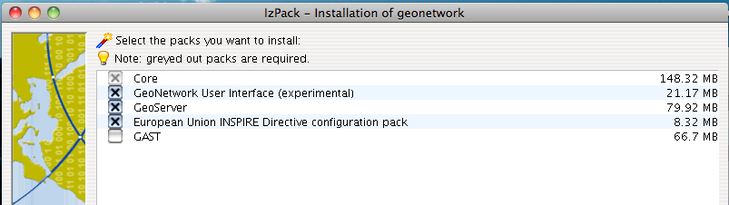

.. _installing:

Installing the software
=======================

New version - New functionality
------------------------------

The new GeoNetwork opensource comes with substantial upgrades of different components for a more intuitive and responsive user-system interaction. Web2 technologies have been adopted, in particular AJAX techniques, to allow for more interactive and faster services in the web interface and for the integration of the existing web map viewer in the home page. Similar functionalities have been implemented in the administrative part of the system, to provide an easier access to the configuration pages related to site settings, catalogue harvesting, scheduling and maintenance.

The search interface has been completely overhauled to provide highly interactive searching capabilities. Furthermore, the new version of GNos embeds GeoServer as map server. Users can now not only overlay OGC web map services available on the web, but also create their own map services for other users to browse without having to download additional plugins. Maps created with web map services can be now saved as PDF and sent to others.

The metadata catalogue handles the latest ISO19115:2003 geographic metadata format based on the ISO19139:2007 schemas, as well as the older ISO19115 final draft format, FGDC and Dublin Core. The metadata editor is able to handle the majority of these complex standards, providing default, advanced and XML editing online tools.

The new version has a number of different harvesting interfaces allowing users to connect their own server to many other catalogues around the world. This is the result of the implementation of the open source reference for the web catalog services according to OGC specifications. Harvesting in the new version is fully compatible with GeoNetwork 2.0 and higher nodes.

We have added advanced online and offline administration functionality to configure, backup and migrate the application. We have also added a convenient import and export format "MEF" or Metadata Exchange Format, that allows the users to move metadata, previews and even data in a convenient single file. GNos can be easily expanded with plugins to export/import metadata to/from other software supporting MEF.

.. figure:: Home_page_s.png

    *Standard home page of GeoNetwork opensource*
  
Where do I get the installer?
-----------------------------

You can find the software on the Internet at the GeoNetwork opensource Community website. The software is also distributed through the SourceForge.net Website at http://sourceforge.net/projects/geonetwork.

Use the platform independent installer (.jar) if you need anything more than a plain Windows installation.

System requirements
-------------------

GeoNetwork can run either on **MS Windows** , **Linux** or **Mac OS X** .

Some general system requirements for the software to run without problems are listed below:

**Processor** : 1 GHz or higher

**Memory (RAM)** : 512 MB or higher

**Disk Space** : 30 MB minimum. However, it is suggested to have a minimum of 250 MB of free disk space. Additional space is required depending on the amount of spatial data that you expect to upload into the internal geodatabse.

**Other Software requirements** : A Java Runtime Environment (JRE 1.5.0). For server installations, Apache Tomcat and a dedicated JDBC compliant DBMS (MySQL, Postgresql, Oracle) can be used instead of Jetty and McKoiDB respectively.

Additional Software
```````````````````

The software listed here is not required to run GeoNetwork, but can be used for custom installations.

#. MySQL DBMS v5.5+ (All) [#all_os]_
#. Postgresql DBMS v7+ (All) [#all_os]_
#. Apache Tomcat v5.5+ (All) [#all_os]_
#. Druid v3.8 (All) [#all_os]_ to inspect the database

Supported browsers
``````````````````

GeoNetwork should work normally with the following browsers:

#. Firefox v1.5+ (All) [#all_os]_
#. Internet Explorer v6+ (Windows)
#. Safari v3+ (Mac OS X Leopard)

How do I install GeoNetwork opensource?
---------------------------------------

Before running the GeoNetwork installer, make sure that all system requirements are satisfied, and in particular that the Java Runtime Environment version 1.5.0 is set up on your machine.

On Windows
``````````

If you use Windows, the following steps will guide you to complete the installation (other FOSS will follow):

1. Double click on **geonetwork-install-2.2.0.exe** to start the GeoNetwork opensource desktop installer
2. Follow the instructions on screen. You can choose to install sample data, install the embedded map server (based on `GeoServer <http://www.geoserver.org>`_ and the CSW 2.0.1 test client. Developers may be interested in installing the source code and installer building tools. Full source code can be found in the GeoNetwork SubVersion code repository.
3. After completion of the installation process, a 'GeoNetwork desktop' menu will be added to your Windows Start menu under 'Programs'
4. Click Start\>Programs\>GeoNetwork desktop\>Start server to start the Geonetwork opensource Web server. The first time you do this, the system will require about 1 minute to complete startup.
5. Click Start\>Programs\>Geonetwork desktop\>Open GeoNetwork opensource to start using GeoNetwork opensource, or connect your Web browser to `http://localhost:8080/geonetwork/ <http://localhost:8080/geonetwork/>`_

.. figure:: installer.png

   *Installer*



   *Packages to be installed*

The installer allows to install these additional packages:

1. GeoNetwork User Interface: Experimental UI for GeoNetwork using javascript components based on ExtJs library.
2. GeoServer: Web Map Server that provides default base layers for the GeoNetwork map viewer.
3. European Union INSPIRE Directive configuration pack: Enables INSPIRE support in GeoNetwork.
 #. INSPIRE validation rules.
 #. Thesaurus files (GEMET, Inspire themes).
 #. INSPIRE search panel.
 #. INSPIRE metadata view.
4. GAST: Installs GeoNetwork's Administrator Survival Tool. See :ref:`gast`.

Installation using the platform independent installer
`````````````````````````````````````````````````````

If you downloaded the platform independent installer (a .jar file), you can in most cases start the installer by simply double clicking on it.

Follow the instructions on screen (see also the section called On Windows).

At the end of the installation process you can choose to save the installation script (Figure Save the installation script for commandline installations).

.. figure:: install_script.png
   
   *Save the installation script for commandline installations*


Commandline installation
````````````````````````

If you downloaded the platform independent installer (a .jar file), you can perform commandline installations on computers without a graphical interface. You first need to generate an install script (see Figure Save the installation script for commandline installations). This install script can be edited in a text editor to change some installation parameters.

To run the installation from the commandline, issue the following command in a terminal window and hit enter to start::

    java -jar geonetwork-install-2.2.0-0.jar install.xml
    [ Starting automated installation ]
    [ Starting to unpack ]
    [ Processing package: Core (1/3) ]
    [ Processing package: Sample metadata (2/3) ]
    [ Processing package: GeoServer web map server (3/3) ]
    [ Unpacking finished ]
    [ Writing the uninstaller data ... ]
    [ Automated installation done ]

You can also run the installation with lots of debug output. To do so run the installer with the flag *-DTRACE=true*::

  java -DTRACE=true -jar geonetwork-install-2.6.0-0.jar

.. [#all_os] All = Windows, Linux and Mac OS X


User interface configuration
----------------------------

GeoNetwork provides two user interface, a **Default** one and a **Widgets based interface**.
The catalog administrator could configure which interface to use in WEB-INF/config-gui.xml.


Configure the Default user interface
````````````````````````````````````

WEB-INF/config-gui.xml is used to define which home page to use. To configure the Default user interface use::

    <client type="redirect" 
      widget="false" 
      url="main.home"
      parameters=""
      stateId=""
      createParameter=""/>
  

Configure the Widgets based user interface
``````````````````````````````````````````

Widgets could be used to build custom interfaces. GeoNetwork provides one Widgets based application to run catalog search, view and edit metadata records.


The Widgets based user interface can be configured using the following attributes:

 - **parameter** is used to define custom application properties like default map extent for example or change the default language to be loaded

 - **createParameter** is appended to URL when the application is called from the administration > New metadata menu (usually "#create").

 - **stateId** is the identifier of the search form (usually "s") in the application. It is used to build quick links section in the administration and permalinks.


Sample configuration::

  <!-- Widget client application with a tab based layout -->
  <client type="redirect" 
    widget="true" 
    url="../../apps/tabsearch/" 
    createParameter="#create" 
    stateId="s"/>
    


Configure the user interface with overrides
```````````````````````````````````````````

Instead of changing config-gui.xml file, catalog administrator could use the overrides mechanism which allows to create custom 
configuration (See :ref:`adv_configuration_overriddes`). By default, no overrides is set and 
the Default user interface is loaded. 

To configure which user interface to load, add the following line in WEB-INF/config-overrides.xml in order to load
the Widgets based user interface::
 
 
    <override>/WEB-INF/config-overrides-widgettab.xml</override>


XSLT processor configuration
----------------------------

The file ``INSTALL_DIR/web/geonetwork/WEB-INF/classes/META-INF/javax.xml.transform.TransformerFactory`` defines
the XSL processor to use in GeoNetwork. The allowed values are:

#. ``de.fzi.dbs.xml.transform.CachingTransformerFactory`` for XSL caching (recommended value for production use). When caching is on, only the main XSL stylesheet last update date is checked and not all included XSL. If you update an included stylesheet, cache is still used.
#. ``net.sf.saxon.TransformerFactoryImpl`` to use Saxon

GeoNetwork sets the XSLT processor configuration on the JVM system properties at startup time for an instant to obtain its TransformerFactory implementation, then resets it to original value, to minimize affect the XSL processor configuration for other applications.

Database configuration
----------------------

Geonetwork uses the `H2 database engine <http://www.h2database.com/>`_ as default. The following additional database 
backends are supported (listed in alphabetical order):

* DB2
* H2
* Mckoi
* MS SqlServer 2008
* MySQL
* Oracle
* PostgreSQL (or PostGIS)


Configure config.xml
````````````````````

The database backend used is configured in **INSTALL_DIR/WEB-INF/config.xml**. The following xml element is of interest::


                <!-- - - - - - - - - - - - - - - - - - - - - - - - - - - - - - - -->
                <!-- H2 database  http://www.h2database.com/ -->
                <!-- - - - - - - - - - - - - - - - - - - - - - - - - - - - - - - -->
                <resource enabled="true">
                 <name>main-db</name>
                 <provider>jeeves.resources.dbms.ApacheDBCPool</provider>
                 <config>
                   <user>admin</user>
                   <password>gnos</password>
                   <driver>org.h2.Driver</driver>
                   <url>jdbc:h2:geonetwork;MVCC=TRUE</url>
                   <poolSize>33</poolSize>
                   <reconnectTime>3600</reconnectTime>
                 </config>
                </resource>

The attribute enabled has to be changed from **true** to **false** ::

                <!-- - - - - - - - - - - - - - - - - - - - - - - - - - - - - - - -->
                <!-- H2 database  http://www.h2database.com/ -->
                <!-- - - - - - - - - - - - - - - - - - - - - - - - - - - - - - - -->
                <resource enabled="false">
                    ...
                </resource>


The resource element for the required database must be enabled. If two resources are enabled, GeoNetwork will fail to start. 
At a minimum, **<user>** , **<password>** and **<url>** have to be changed. (Showing DB2 as an example without loss of generality)::

               <resource enabled="true">
                        <name>main-db</name>
                        <!-- <provider>jeeves.resources.dbms.DbmsPool</provider> -->
                        <provider>jeeves.resources.dbms.ApacheDBCPool</provider>
                        <config>
                                <user>db2inst1</user>
                                <password>mypassword</password>
                                <driver>com.ibm.db2.jcc.DB2Driver</driver>
                                <url>jdbc:db2:geonet</url>
                                <poolSize>10</poolSize>
                        </config>
                </resource>


Connection Pool
```````````````

GeoNetwork support two types of database connection pool:

* Jeeves DbmsPool
* `Apache DBCP pool <http://commons.apache.org/dbcp/>`_ (recommended for 2.7.x and later)

The resource section allows to configure advanced parameters for the pool:

* poolSize
* maxTries
* maxWait


.. TODO Add more details about poolsize, maxWait, ...


JDBC Drivers
````````````
The JDBC driver jar files should be in **GEONETWERK_INSTALL_DIR/WEB-INF/lib**. 
For Open Source databases, like MySQL and PostgreSQL, the jar files are already installed. 
For commercial databases the jar files must be downloaded and installed manually. This is due to licensing issues.

* `DB2 JDBC driver download <https://www-304.ibm.com/support/docview.wss?rs=4020&uid=swg27016878>`_
* `MS Sql Server JDBC driver download <http://msdn.microsoft.com/en-us/sqlserver/aa937724>`_
* `Oracle JDBC driver download <http://www.oracle.com/technetwork/database/features/jdbc/index-091264.html>`_


Creating and initializing tables
````````````````````````````````

During the starting process geonetwork checks if the needed tables are present. 
If not, the tables are created and filled with initial data. 

For each start an additional check is made if the version of geonetwork matchtes the version of the tables. 
In case of a version mismatch, a migration script is triggered.

An alternative is to execute the scripts manually by the db admin. 

* The scripts for initial setup are located in **GEONETWERK_INSTALL_DIR/WEB-INF/classes/setup/sql/create/**
* The scripts for inserting initial data  are located in **GEONETWERK_INSTALL_DIR/WEB-INF/classes/setup/sql/data/**
* The scripts for migrating are located in **GEONETWERK_INSTALL_DIR/WEB-INF/classes/setup/sql/migrate/**

An example for a manual DB2 setup::

        db2 create db geonet
        db2 connect to geonet user db2inst1 using mypassword
        db2 -tf GEONETWERK_INSTALL_DIR/WEB-INF/classes/setup/sql/create/create-db-db2.sql > res1.txt
        db2 -tf GEONETWERK_INSTALL_DIR/WEB-INF/classes/setup/sql/data/data-db-default.sql > res2.txt
        db2 connect reset

After execution, check **res1.txt** and **res2.txt** if errors have occurred.

.. note::

    Known DB2 problem. DB2 may produce an exception during first time geonetwork start.

        DB2 SQL error: SQLCODE: -805, SQLSTATE: 51002, SQLERRMC: NULLID.SYSLH203

    Solution one is to setup the database manually a described in the previous chapter.
    Solution two is to drop the database, recreate it,locate the file db2cli.lst in the db2 installation folder and execute

        db2 bind @db2cli.lst CLIPKG 30


Upgrading to a new Version
==========================

The upgrade process from one version to another is typically a fairly simple process.  Following the normal setup instructions and Geonetwork should upgrade the internal datastructures from the old version to the new version.  The exceptions to this rule are:

* Migration to Geonetwork 2.8 will reset all harvesters to run every 2 hours. This is because the underlying harvester scheduler has been changed and the old schedules are not longer supported.  In this case one must review all the harvesters and define new schedules for them.
