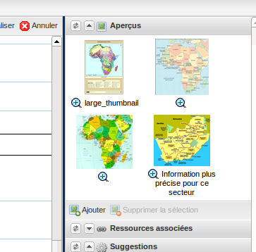
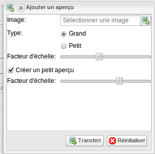
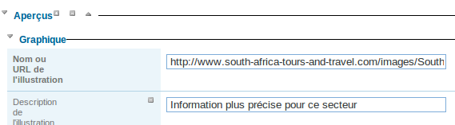

.. include:: ../../substitutions.txt

.. _metadata_create:

Création et édition de métadonnées
==================================

Cette partie présente la manière de créer et saisir des métadonnées dans le catalogue
en utilisant l'éditeur en ligne. Pour cela le système de modèles (templates en anglais) est utilisé.
Les sujets abordés sont les suivants :

.. contents:: :local:

Pour ajouter et éditer une métadonnée, un utilisateur doit être **enregistré** comme **Editeur** dans au moins un groupe. 
Si ce n'est pas le cas, contactez l'administrateur.

Pour la création d'une métadonnée utilisant l'éditeur en ligne, 2 options sont possibles :

- partir d'un modèle de saisie à partir du menu **Créer une métadonnée**
- dupliquer un fiche à partir des résultats de recherche


Les modèles de saisie
---------------------


Le catalogue fournit un
certain nombre de modèle de métadonnées basés sur les différents standards supportés (cf. :ref:`supported_format`). Ces modèles
permettent de décrire divers types de ressources (eg. données vecteur ou raster, services
WMS/MFS, service de téléchargement) avec un nombre minimal d'éléments pré-remplis. 
Ces modèles peuvent être édités et complétés avec des éléments de la vue
avancée tout comme une métadonnée.

Si aucun modèle n'est disponible, il est possible de les ajouter à partir de l'interface d'administration (cf. :ref:`samplemetadata`).


Créer une nouvelle métadonnée
-----------------------------

Une fois l'utilisateur authentifié (cf. :ref:`how_to_login`), **dans la barre d'outil de présentation des résultats** 
ou bien dans la page d'accueil, cliquer sur **Administration** puis :

#. Selectionner **"nouvelle métadonnée"**.
#. Selectionner le modèle de métadonnée sachant que d'autres modèles peuvent être créés.
#. Selectionner le **Groupe** auquel sera rattaché la métadonnée. Les groupes proposés sont ceux autorisés par l'administrateur pour l'utilisateur en cours d'édition.
#. Cliquez sur **"créer"**.


.. figure: create.png

   Formulaire de création d'une métadonnée

Le formulaire permet de trier les métadonnées par schéma, par titre en cliquant sur les en-têtes des colonnes.

Une nouvelle métadonnée basée sur le modèle sélectionné est ensuite créée. Un identifiant unique lui est attribué. Par défaut, 
elle n'est visible que pour les utilisateurs du groupe.


Basculer entre les vues
```````````````````````

Les vues ont été présentées précédemment (cf. :ref:`metadata_edit_mode`).

Lorsque vous créez un nouvel enregistrement, vous pouvez choisir entre
les différentes vues du standard. Pour charger la vue, cliquez simplement sur la vue correspondante dans le menu **Affichage**.
La vue désactivée dans le menu correspond à la vue courante.


Les champs obligatoires et conditionnels
``````````````````````````````````````````
Les champs obligatoires sont en gras avec un cadre gris ou rouge si ils ont une valeur invalide.

.. figure: invalidField.png

   Champ titre obligatoire valide mais un résumé invalide (car vide)


Les champs dont la saisie est invalide sont entourés en rouge.
Il peut s'agir :

- d'un champ obligatoire non rempli
- d'un champ numérique contenant du texte (avec ou sans décimale)
- d'une adresse email invalide.


Il existe par ailleurs des champs conditionnels.
Par exemple, pour les contacts, 

- un des champs nom, organisation ou position pour un contact
  doit être renseigné pour le standard ISO 19139.
- un des champs organisation ou email doit être renseigné pour les règles d'implémentation d'INSPIRE 

  .. figure:: PoC_Maint.png

  *Point de contact*

Pour identifier les erreurs sur les champs conditionnels, utiliser le rapport
de validation (cf. :ref:`metadata_validation`).


L'aide
``````

La définition de chacun des champs est visible dans la section **Aide** du panneau de droite.
Cette aide indique :

- le nom de l'élément
- la définition de l'élément
- l'identifiant du standard (eg. iso19139.fra)
- le nom de la balise de l'élément (eg. gmd:title)

La description de l'élément parent est également présentée.

.. figure:: helpPanel.png

   Aide contextuel sur l'élément titre court contenu dans la section identification


.. _editor_control:

Utiliser les contrôles des champs de l'éditeur
``````````````````````````````````````````````

Différents types de champs existent :

- les champs de type texte simple
- les champs de type zone de texte

.. figure:: textField.png


- les listes de valeurs
- les dates

.. figure:: dateFieldAndCodeList.png

   Champ date avec une liste de valeur pour le type de date

- la saisie d'emprise géographique (cf. :ref:`geobox_editor`)
- la saisie des champs de type périodes

.. figure:: periodField.png

   Champ de type période


La cardinalité des champs est définie dans le schéma du standard de métadonnées. Ce schéma est utilisé pour placer les 
contrôles correspondants à côté des champs de saisie.

Ces contrôles sont :

- le plus pour ajouter un champ
- le moins pour supprimer un champ
- la flêche vers le haut pour déplacer le champ vers le haut
- la flêche vers le bas pour déplacer le champ vers le bas


.. figure:: editorControl.png

   Bouton de contrôle dans l'éditeur


En complément, l'icône jumelle permet la recherche dans des dictionnaires. Elle est disponible pour les champs de type :

- mots clés
- projection
- (optionel) contact

La flêche présente devant les titres de section permettent de cacher le bloc placé en dessous.

.. figure:: toggleControl.png


Saisir les métadonnées pour vos données géographiques
-----------------------------------------------------

.. TODO : cf la version anglaise http://geonetwork-opensource.org/manuals/trunk/users/quickstartguide/new_metadata/index.html#entering-metadata-for-your-map


.. _geobox_editor:

Saisir une emprise géographique
-------------------------------

Dans la section identification, il est possible de saisir l'emprise géographique de la métadonnée.
Celle-ci est en générale un rectangle (ie. LatLongBoundingBox). L'interface de saisir permet :

- la saisie manuelle des coordonnées dans une des projections configurées pour le catalogue
- la saisie d'un rectangle sur la carte
- le choix d'une région dans la liste déroulante
- l'effacement de l'objet


.. figure:: geoboxField.png


A noter qu'il est également possible de calculer l'emprise à partir des mots clés géographique (cf. :ref:`compute_extent`).

Il est possible de saisir plusieurs emprises pour une fiche de métadonnée. Ceci se révèle util pour un jeu de donnée
sur la france métropolitaine et les COM par exemple.


Le standard ISO permet également la saisir d'un polygone. Dans ce cas, l'interface de saisir propose un
outil de saisie de polygone ou de cercle.

.. figure:: geoField.png

La case à cocher **Exclusion** permet d'indiquer si le polygone est une surface recouverte par des données ou ne comportant pas de données.


L'aide à la saisie
------------------

Suggestion simple
`````````````````

Pour certains champs, il est possible d'avoir une liste de suggestion. Cette liste est placé à côté du champ de saisie.


.. figure:: scaleField.png

   Suggestion pour le champ niveau d'échelle


.. figure:: dqField.png

   Suggestion pour les champs nom du test et définition (Annexe C de l'ISO19138)
   
   
Une suggestion permet d'accèder rapidement à des listes classiques de valeurs et de simplifier la saisie.


.. _auto_correction:

Mécanisme de suggestion par analyse des métadonnées et correction automatique
`````````````````````````````````````````````````````````````````````````````

Dans le paneau droit de l'éditeur, le bloc **Suggestion** permet d'avoir les règles applicables à la métadonnée en cours d'édition.
Ces règles dépendent du standard de métadonnées.

Prenons le cas d'une métadonnée contenant un mot clé contenant des virgules :


.. figure:: suggestion1.png
   
   Mots clés contenant des virgules comme séparateur. Ceci n'est pas recommandé.


.. figure:: suggestion2.png
 
   Le mécanisme d'auto-correction, propose à l'éditeur de séparer les mots clés.


.. figure:: suggestion3.png

   Résultat après le traitement automatique
  
  
Les mécanismes de contrôle pour le standard ISO19139 sont les suivants :

- Séparation des mots clés contenant des virgules
- Correction des niveaux d'échelle contenant des 1/25000 ou 1:25000 en 25000
- Calcul de l'emprise à partir des mots clés géographique
- Ajout d'une section conformité INSPIRE si un thème INSPIRE se trouve dans les mots clés
- Ajout des systèmes de projection si un service WMS est associé
- Ajout d'un aperçu si un service WMS est associé
- Ajout de l'emprise si un service WMS est associé


.. _metadata_validation:

Valider les métadonnées
-----------------------

Dans le paneau droit de l'éditeur, le bloc **Validation** permet d'obtenir le niveau de validité de la métadonnée en cours d'édition
vis à vis :

- du schéma du standard (Schéma XSD)
- des recommandations ISO
- des recommandations INSPIRE (optionel)
- des recommandations |project_name|


.. figure:: validationreport.png


Saisir des métadonnées en plusieurs langues
-------------------------------------------

De prime abord, il pourrait être envisagé de dupliquer une fiche pour la rendre accessible en plusieurs langues.
Cependant la norme ISO19139 définie une manière de traduire tout ou partie d'une métadonnées.

Un éditeur peut donc créer des métadonnées ISO en plusieurs langues. Pour cela, il est nécessaire de déclarer une
nouvelle langue dans la fiche :

- Tout d'abord, vérifiez que la langue de la métadonnée est définie dans la section sur les métadonnées.

- Ensuite, ajouter une ou plusieurs autres langues dans cette même section.


En édition, chaque élément pouvant être traduit est composé de :

- une zone de texte

- une liste de sélection de la langue (langues déclarées dans la section autres langues)


Par défaut, la langue sélectionnée est la langue de l'interface si la langue est définie dans la métadonnée. 
Sinon la langue principale de la métadonnée est affichée.


.. figure:: editor-multilingual.png


En option, le service de traduction de Google peut être utilisé. 
Les traductions peuvent être suggérées pour l'éditeur en cliquant sur la petite icône située à droite du sélecteur de langue. 
Le service de traduction traduit le texte dans la langue principale de la métadonnée dans la langue sélectionnée.


En mode consultation, en fonction de langue de l'interface, si cette langue est définie dans les métadonnées, 
les éléments sont affichés dans cette langue
sinon dans la langue par défaut de la métadonnée.
Ce comportement est également appliqué pour les réponses au format dublin-core via CSW pour une fiche en ISO.


Associer des aperçus
--------------------

Au sein de la fiche de métadonnée, dans la section identification, il est possible
d'ajouter des aperçus pour donner une idée des données. Le catalogue permet d'associer 2 types d'aperçus : 

- les aperçus chargés dans le catalogue
- les aperçus associés par un lien sur le web


L'ensemble des aperçus sont présentés en mode édition dans le paneau de droite, en mode consultation et dans les résultats de recherche.




Le premier type d'aperçu est chargé dans le catalogue via l'assistant suivant :



Ces aperçus peuvent être redimensionné lors du chargement. Une petite et une grand vignette peuvent être créée. Elles sont alors automatiquement
référencées dans la métadonnée. Ces vignettes seront présente dans le répertoire public du format MEF (cf. :ref:`mef`).

Il est également possible de saisir l'URL d'une image disponible sur Internet via l'éditeur :




Associer des logos aux contacts
-------------------------------

TODO


Associer des données à télécharger
----------------------------------

Il est possible de décharger des fichiers dans le catalogue et ainsi associer
des données ou des documents à une fiche (eg. ESRI Shapefile, ZIP, PDF, image). Ces fichiers sont alors
accessible fonction des privilèges de téléchargement associés à la fiche.

Afin d'ajouter des documents, suivre les étapes suivantes :

#. Vérifier que la taille du fichier est raisonnable (par défaut, la taille maximale est configurée à 100Mo).
 
#. Le champ URL peut être laissé vide. Celui-ci sera mis à jour après l'ajout

#. Sélectionner le **protocole** fichier à télécharger. Cette sélection déclenchera l'affichage du bouton d'ajout.

#. Cliquer sur le bouton **import de fichier** puis sélectionner un fichier sur votre machine.

#. Valider en cliquant sur le bouton **transférer**

.. figure:: uploadData.png


Il est recommandé d'ajouter une **description** qui sera utilisé comme nom du lien hypertexte pour le fichier.


Associer un service WMS pour la visualisation des données
---------------------------------------------------------

Vous pouvez associer une donnée publiée dans un service OGC WMS via la section ressource en ligne.

#. Editer la métadonnée

#. Aller dans l'onglet distribution

#. Saisir dans le champ URL l'adresse URL du service (eg. http://services.sandre.eaufrance.fr/geo/ouvrage)

#. Choisir le protocole WMS (ie. OGC Web Map Service ver 1.1.1)

#. Saisir dans le nom, le nom de la couche tel qu'écrit dans le document GetCapabilities du service

#. Eventuellement, saisir une description permettant d'avoir un libellé plus pertinent que le nom de la couche

#. Sauvegarder

.. figure:: linkwms.png


Vous avez alors un bouton carte interactive dans les résultats de recherche.


La representation XML sera la suivante :

::

      <gmd:transferOptions>
        <gmd:MD_DigitalTransferOptions>
          <gmd:onLine>
            <gmd:CI_OnlineResource>
              <gmd:linkage>
                <gmd:URL>http://services.sandre.eaufrance.fr/geo/ouvrage</gmd:URL>
              </gmd:linkage>
              <gmd:protocol>
               <gco:CharacterString>OGC:WMS-1.1.1-http-get-map</gco:CharacterString>
              </gmd:protocol>
              <gmd:name>
                <gco:CharacterString>REPOM</gco:CharacterString>
              </gmd:name>
              <gmd:description>
                <gco:CharacterString>Installations portuaires</gco:CharacterString>
              </gmd:description>
            </gmd:CI_OnlineResource>
          </gmd:onLine>
        </gmd:MD_DigitalTransferOptions>
      </gmd:transferOptions>
    </gmd:MD_Distribution>
  </gmd:distributionInfo>


.. _editor_geopublication:


Publier les données téléchargées en WMS, WFS, WCS
-------------------------------------------------

Les interactions avec un serveur cartographique tel que GeoServer permettent à l'utilisateur de rapidement configurer les données pour leur diffusion.

Les serveurs cartographiques supportés sont :

- GeoServer embarqué avec |project_name|

- Un GeoServer distant (version 2.x ou sup.)


.. figure:: geopub-tiff.png


Ce mécanisme permet aux utilisateurs la publication de fichier de type :

- RASTER GeoTiff, ECW : non zippé, zippé ou URL du fichier

- ESRI Shapefile : zippé ou URL du fichier

- Table PostGIS


Dans le cas des fichiers zippés, le jeu de données doit être associé à la métadonnée tel que décrit dans 
le chapitre `associer des données à télécharger <#associer-des-donnees-a-telecharger>`_.
Une fois téléchargé, un bouton permet de publier la couche dans le service cartographique. 
Un autre permet la mise à jour de la section ressource en ligne pour associer le service
ou les services.


Configuration
`````````````
Si après l'ajout de la données à une fiche, vous ne voyez pas le bouton de géopublication, 
demandez à l'administrateur de vérifier la configuration.
Cette fonctionnalité est désactivée par défaut. Elle peut être activée par configuration dans le fichier config-gui.xml::

  <!-- Display the geopublisher option for all updloaded files-->
  <editor-geopublisher/>


Si vous ne voyez pas de serveur cartographique dans l'assistant de publication, demandez à l'administrateur d'ajouter un noeud dans la configuration
dans le fichier geoserver-nodes.xml::

     <!-- 
		Add here all geoserver node which could
		be configure by GeoNetwork.
		
		GeoServer 2.x or later are supported. The REST API must be installed in the GeoServer node.
		If you want to be able to publish in different workspaces, create as many nodes as 
		workspaces.
		
		@param name 		Name of the GeoServer node, display to metadata editor
		@param namespace	Namespace to use. If not set, GeoServer will link store to another namespace.
		@param adminUrl		GeoServer REST service config URL
		@param wmsUrl		GeoServer WMS service URL use to display map preview
		@param wfsUrl		(Not used) GeoServer WFS service URL use to display map preview
		@param stylerUrl	(Optional) GeoServer WFS service URL use to display map preview
		@param user			GeoServer user login
		@param password		GeoServer user password 
	-->
	<node>
		<id>geoserverEmbedded</id>
		<name>GeoServer (workspace: gn)</name>
		<namespacePrefix>gn</namespacePrefix>
		<namespaceUrl>http://geonetwork-opensource.org</namespaceUrl>
		<adminUrl>http://localhost:8080/geoserver/rest</adminUrl>
		<wmsUrl>http://localhost:8080/geoserver/wms</wmsUrl>
		<wfsUrl>http://localhost:8080/geoserver/wfs</wfsUrl>
		<wcsUrl>http://localhost:8080/geoserver/wcs</wcsUrl>
		<stylerUrl>http://localhost:8080/geoserver/styler/index.html</stylerUrl>
		<user>admin</user>
		<password>geoserver</password>
	</node>


Associer vos données
````````````````````

Pour associer un jeu de données, la procédure est la suivante :

* Editer une fiche de métadonnée

* Dans le cas d'un zip ou d'une image à télécharger, déposer un fichier tel que décrit dans le 
  chapitre `associer des données à télécharger <#associer-des-donnees-a-telecharger>`_

============   ============================================================= ===============================
Champs         Vecteur (Shapefile zippé)                                     RASTER (zippé ou non)
============   ============================================================= ===============================
URL            URL vers le fichier générée par le catalogue lors du dépôt    idem
               http://localhost:8080/geonetwork/srv/en/resources.get?id=1631
               &fname=CCM.zip&access=private                                 
Protocole      Fichier à télécharger                                         idem
               WWW:DOWNLOAD                                                  
Nom            Nom du fichier (lecture seul)                                 idem
============   ============================================================= ===============================

* Dans le cas d'une table PostGIS ou d'un fichier sur le réseau local, saisir les informations suivantes :

============   ============================================================= ===============================
Champs         Vecteur (Table PostGIS)                                       RASTER
============   ============================================================= ===============================
URL            Chaîne de connexion à la base de données                      Nom du répertoire 
               jdbc:postgresql://localhost:5432/login:password@db            file:///home/geodata/
Protocole      Table PostGIS                                                 Fichier RASTER
               DB:POSTGIS                                                    FILE:RASTER
Nom            Nom de la table                                               Nom du fichier
============   ============================================================= ===============================


Publier vos données
```````````````````

Une fois associé par téléchargement ou par référencement de l'URL du fichier ou de la table, l'assistant de géopublication 
est disponible en mode édition pour chaque ressource en ligne. L'édition des ressources en ligne est en générale accessible
depuis la majorité des modes d'édition. Quoiqu'il en soit, il est possible en mode avancé, d'aller dans la 
section ISO distribution > ressource en ligne pour accèder à l'ensemble des champs. Le bouton d'ouverture de l'assistant 
est placé à côté du champ fichier :

.. figure:: geopub-wizard-button.png


Remarque :

  Si le bouton n'apparaît pas et que le système semble bien configuré, cliquer sur le bouton sauver pour rafraîchir l'éditeur.


Une fois l'assistant ouvert, les étapes sont les suivantes :

* Choisir un noeud vers lequel publier la donnée depuis la liste des serveurs cartographiques disponibles

.. figure:: geopub-node-selector.png


* |project_name| vérifie alors :

    - que le fichier est valide (eg. le ZIP contient un seul Shapefile ou tiff)
    - que la couche est déjà publiée dans le serveur distant. Dans l'affirmative, la couche est ajoutée à l'aperçu.

.. figure:: geopub-menu.png

* Le bouton **publier** publie la couche dans le serveur cartographique. Si la donnée est déjà présente, elle est mise à jour.
* Le bouton **dépublier** supprime la donnée du serveur cartographique sélectionné.
* Le bouton **style** est disponible si un outil de gestion de style est installé et déclaré
  dans la configuration du serveur cartographique.

Aucun nom de couche n'est demandé à l'utilisateur car celui-ci est généré à partir du nom du fichier.
Dans le cas de fichier ZIP, le nom du fichier ZIP DOIT être égale à celui du Shapefile ou du GeoTiff 
(ie. dans le cas de rivers.shp, le fichier ZIP sera rivers.zip). Un entrepôt, une couche et un style
sont créés pour chaque couche.


Référencer les données après publication
````````````````````````````````````````

Le bouton **lier le service à la fiche** ajoute les informations pour faire la liaison avec la couche dans les services sélectionnés :

     - sélectionner un ou plusieurs protocoles (WMS, WFS, WCS) fonction du serveur cartographique et de la donnée publiée
     - cliquer sur ajouter les liens

.. figure:: geopub-service-type.png

La création de ces liens permettra par la suite au catalogue de créer les boutons ajouter à la carte pour visualiser les 
données sur la carte interactive (cf. `associer un service WMS <#associer-un-service-wms-pour-la-visualisation-des-donnees>`_).


Associer les métadonnées
------------------------

En utilisant l'éditeur de métadonnée de |project_name|, l'utilisateur peut définir 3 types de relation :

- relation parent /enfant via l'élément gmd:parentIdentifier dans la section métadonnées

- relation métadonnées de données / métadonnées de services via l'élément srv:operatesOn de la section identification des métadonnées de services

- catalogue d'attribut (ISO19110) / métadonnées de données (ISO19139)


Toutes ces relations sont présentées dans l'éditeur, en haut à droite. Le menu permet la navigation entre les métadonnées.
Seul les métadonnées visibles pour l'utilisateur sont affichées (ie. une métadonnée peut être associée mais non affichée car
l'utilisateur n'a pas les privilèges pour la consultation de celle-ci).


Relation de type parent/enfants
```````````````````````````````

Pour créer des relations parents/enfants, l'éditeur peut sélectionner l'option créer un enfant dans le menu autres actions.

.. figure:: relationCreateChild.png


En utilisant cette option, l'identifiant du parent est automatiquement mis à jour lors de la copie de l'enregistrement; le reste de la métadonnée est copiée.


L'éditeur peut également associer une métadonnée existante en allant dans la vue avancée section métadonnée et mettre à jour le champ identifiant du parent.
En cliquant sur le lien ajouter ou mettre à jour le parent dans le menu des relations vous emmènera également dans cette section.
En cliquant sur le (+) pour déplier le champ identifiant du parent, l'assistant de sélection d'une métadonnée s'affiche.

Une fois le parent sélectionner, il apparaîtra dans le menu des relations.

.. figure:: relationListChild.png

Si une métadonnée à un enfant associé, l'éditeur proposera le mécanisme de mise à jour des enfants qui permet de propager les informations
du parent vers l'ensemble de ses enfants.

L'interface suivant permet de configurer le transfert d'information :

.. figure:: relationUpdateChild.png


Métadonnées de données, métadonnées de services
```````````````````````````````````````````````

Les services (eg. WMS, WFS) pourront être référencés dans le catalogue.


La métadonnée de service (MDS) est saisie dans la norme ISO19139/ISO19119.

 
L'ISO19119 définie la section "identification du service".


Il est alors possible de décrire 4 types de relations dans les MDD et MDS :

#. Les métadonnées de données >> la couche correspondante diffusée par le service
   Aucune méthode n'est définie par l'ISO ou INSPIRE pour créer cette relation. Cependant, |project_name| a utilisé la section distribution pour cela. Voir `la section sur l'association d'un service WMS <#associer-un-service-wms-pour-la-visualisation-des-donnees>`_.
   
#. Les métadonnées de service OGC >> métadonnée de données
   
   Cette relation est stockée de la manière suivante dans le document XML :

   .. code-block:: xml

         <srv:operatesOn uuidref="9fe71d39-bef7-4d45-a3b3-12afbd01908f" />
       </srv:SV_ServiceIdentification>
     </gmd:identificationInfo>
    
   Le catalogue propose une popup de recherche et sélection pour faire l'association. Une fois la relation présente, il est possible de naviguer de la métadonnée de service, vers la métadonnée de données.
   
#. Les métadonnées du service >> le service  
   La métadonnée de service décrit les opérations du service ainsi que son point d'accès en général saisie dans la section distribution.
   

#. Les métadonnées du service >> les couches diffusées par le service   
   La spécification CSW définit la manière d'associer les données diffusées par un service et sa métadonnée. Cette information reste de moindre importance car le client par demande du GetCapabilities peut rapidement obtenir cette information.
   L'élément coupledResource est utilisé pour décrire la relation :
   
   .. code-block:: xml

      <srv:coupledResource>
        <srv:SV_CoupledResource>
          <srv:operationName>GetMap</srv:operationName>
          <srv:identifier>9fe71d39-bef7-4d45-a3b3-12afbd01908f</srv:identifier>
          <gco:ScopedName>REPOM</gco:ScopedName>
        </srv:SV_CoupledResource>
      </srv:coupledResource>
   
   
   
L'interface suivante permet l'association entre une métadonnée de données et une métadonnée de service :

.. figure:: relationCreateService.png


L'éditeur peut définir la nom de la couche en utilisant la liste déroulante 
(qui si le service est en ligne est remplie par interrogation du GetCapabilities du service WMS)
ou en saisissant le nom de la couche dans le champ texte. 
Cette information est nécessaire pour afficher les données sur la carte interactive.


Seul les relations au sein d'un même catalogue sont gérées. L'utilisation d'XLink n'est pas totalement supportée
pour la création de ces relations.


Catalogue d'attributs
`````````````````````


Le catalogue d'attributs sont stockés selon le standard ISO 19110. La relation entre catalogue d'attributs et métadonnée de données
sont réalisés avec le menu associer un catalogue d'attribut. 


Note : La relation n'est pas stockée dans la métadonnée mais dans la base de données.
Un catalogue moissonnant l'une des deux métadonnées n'aura pas connaissance de cette relation. Elle est gérée par |project_name|.


.. _compute_extent:

Calcul de l'étendue par analyse des mots clés
---------------------------------------------

L'éditeur peut demander à |project_name| d'analyser les mots clés de la fiche en cours d'édition pour calculer l'emprise. Ce mécanisme permet une saisie plus efficace.
Par exemple, dans la section identification saisissez "FRANCE", "GUADELOUPE", "MARTINIQUE" dans les mots clés puis cliquer sur calculer les emprises pour ajouter les 3 emprises automatiquement.

L'approche est la suivante :

- Pour chaque mot clé

- Recherche le mot clé dans les thésaurus du catalogue

- Si le mot clé à une étendue

- Ajoute une étendue avec sa description dans la métadonnée


Ce processus peut être lancé selon 2 modes :

- Ajout : Conserve les étendues existantes et rajoute les nouvelle à la fin.
- Remplace : Supprime les étendues n'ayant que des éléments de type emprise (les emprises temporelle, verticale ou polygone englobant ne sont pas supprimées), et ajoute les nouvelles à la fin

L'éditeur peut supprimer les étendues inutiles après le processus.

Ce processus ne fonctionne que si des thésaurus de type géographique sont installés dans le catalogue.


.. figure:: computebbox-selectkeyword.png


Le lancement du processus se fait par le menu autres actions.

.. figure:: computebbox-button.png


La métadonnée est sauvegardée pendant le processus.

.. figure:: computebbox-results.png


Sauvegarder la métadonnée avant le lancement de l'opération si vous avez fait des modifications.


Attribuer des catégories
------------------------

Pour finaliser le tout, vous pouvez assigner des catégories à vos métadonnées. 
Les catégories choisies vont déterminer sous quelles catégories votre fiche 
va s'afficher dans la page de recherche.
Pour assigner des catégories à une carte, suivrez ces étapes :

 - Trouver votre fiche en utilisant le formulaire de recherche.
   En fonction du nombre de résultats, positionnez-vous sur la fiche, 
   ou sur le menu **Autres actions** (sur la droite). Vous allez voir 
   une liste de boutons, incluant un bouton **Catégories**.

 - Cliquez sur le bouton **Catégories**. Cela va afficher une nouvelle 
   fenêtre. Vous pouvez assigner une ou plusieurs catégories en les sélectionnant 
   ou désélectionnant sur cette page. Cocher ou décocher simplement 
   les petites cases en face des catégories.


.. figure:: categoriesManag.png


Si vous n'avez pas accès à ces informations, consulter :ref:`admin_category`.


