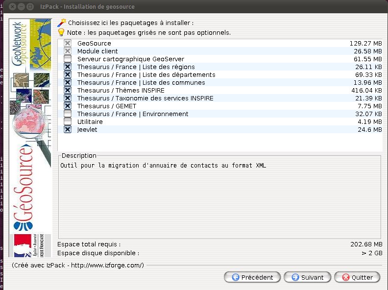

.. _jeevlet:
.. include:: ../substitutions.txt

Jeevlet
=======

L’application peut être soit déployée dans un conteneur de servlet Tomcat ou Jetty, 
en tant que webapp J2EE classique, soit lancée en mode standalone. Le module actuel
permet le lancement en mode standalone. Dans ce cas, il s’agit d’une application java 
classique démarrée en ligne de commande, qui elle-même lance un processus serveur HTTP
selon les bibliothèques de connecteur HTTP présentes. 

Procédure d'installation
------------------------

Jeevlet fait partie de l'installer GéoSource à partir de la version 2.7.1.
A partir du choix des modules de l'installer sélectionner le module Jeevlet.
Jeevlet est installer dans le répertoire jeevlet.

A partir des sources, récupérer le module depuis le dépôt SVN ::

    svn co https://geonetwork.svn.sourceforge.net/svnroot/geonetwork/sandbox/GeoSource/branches/jeevlet jeevlet

Pour compiler Jeevlet à partir des sources, il est nécessaire de l'ajouter au projet |project_name| (du fait de la dépendance envers le module Jeeves).

Configurer Jeevlet
------------------

Lors du lancement de Jeevlet, l'ensemble des configurations des catalogues est chargé. 
Pour cela modifier le fichier jeevlet.properties et adapter la variable app_path. 
Cette variable doit pointer vers le répertoire de l'application (ie. la webapp).
Il est souhaitable de vérifier la configuration par défaut (eg. app_port).

Créer un nouveau catalogue
--------------------------

Dans le répertoire jeevlet/bin lancer ::

    ./node.sh Admin_RHA www-data RHA jdbc:postgresql://localhost:5432/RHA org.postgresql.Driver 2

Démarrage et arrêt de l’application
-----------------------------------

Dans le répertoire jeevlet/bin lancer pour démarrer l'application ::

    ./startup.sh

L’application est ainsi accessible à l’adresse suivante ::

    http://{hostname}:{port}/catalogue-{id-catalogue}/

Pour l’arrêt de l’application, lancer le script ::

    ./shutdown.sh

FAQ
---

Que faire en cas de "rejectedExecution" dans le log de Jeevlet ?
~~~~~~~~~~~~~~~~~~~~~~~~~~~~~~~~~~~~~~~~~~~~~~~~~~~~~~~~~~~~~~~~

Le problème vient du nombre de thread autorisé pour les applications Restlet. L'erreur est du type ::

    Jul 8, 2011 8:39:03 AM org.restlet.engine.http.connector.BaseHelper$1 rejectedExecution
    INFO: Worker service thread pool: 1 core size, 50 largest size, 50 maximum size, 50 current s

Solutions : Modifier le paramètre max pool size dans jeevlet.properties

Que faire en cas de "SQLException pool error" dans le log de l'application ?
~~~~~~~~~~~~~~~~~~~~~~~~~~~~~~~~~~~~~~~~~~~~~~~~~~~~~~~~~~~~~~~~~~~~~~~~~~~~

Le problème vient du fait que l'application ne peut obtenir une connexion à la base de données ::

    2011-07-08 08:46:05,186 ERROR [jeeves.service] - Exception when executing service
    2011-07-08 08:46:05,187 ERROR [jeeves.service] -  (C) Exc : java.sql.SQLException: Cannot get a connection, pool error: Timeout waiting for idle object
    2011-07-08 08:46:05,188 DEBUG [jeeves.service] - Raised exception while executing service
    <error id="error">
      <message>Cannot get a connection, pool error: Timeout waiting for idle object</message>
      <class>SQLException</class>
    <stack>
        <at class="org.apache.commons.dbcp.PoolingDriver" file="PoolingDriver.java" line="188" method="connect" />

Solutions : Augmenter la taille du pool de connexion à la base dans config.xml

Ce que ne supporte pas Jeevlet
------------------------------

Jeevlet présente quelques limitations par rapport à un fonctionnement GéoSource dans un container Java
principalement lié au fait que le catalogue devient une application RESTLET
 
* l'impression : pas de servlet d'impression
* pas de proxy (nécessaire aux requêtes HTTP type GetCapabilities depuis le client lié au problème de requête CrossDomain). Une option serait d'avoir un proxy sur apache dans le même domaine ?

